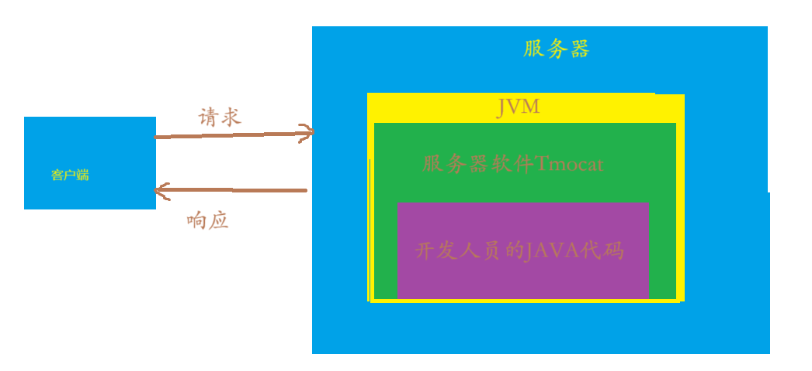
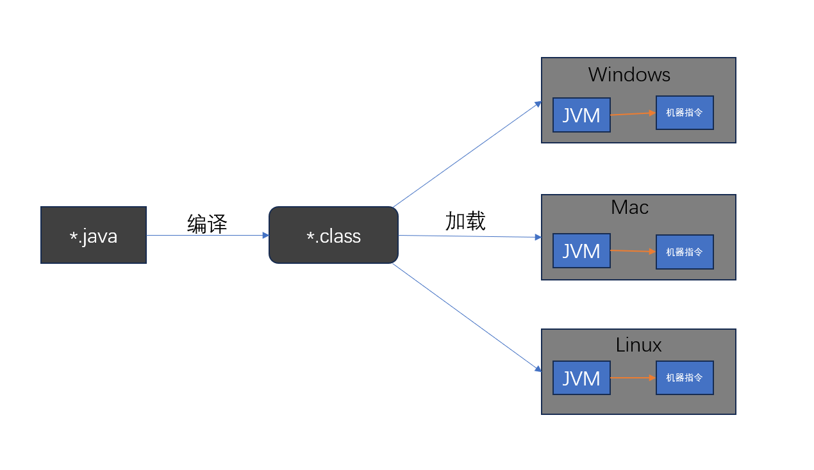
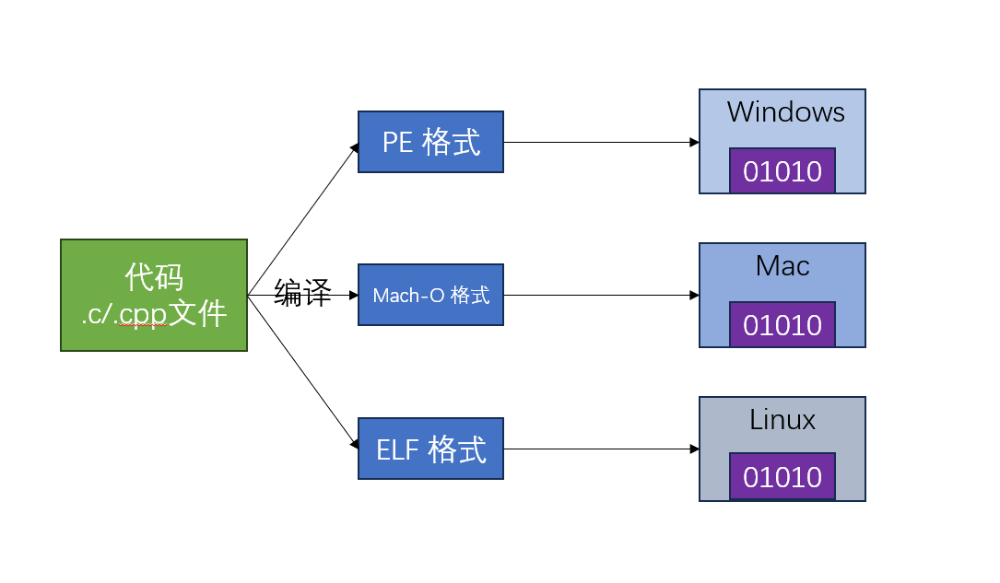
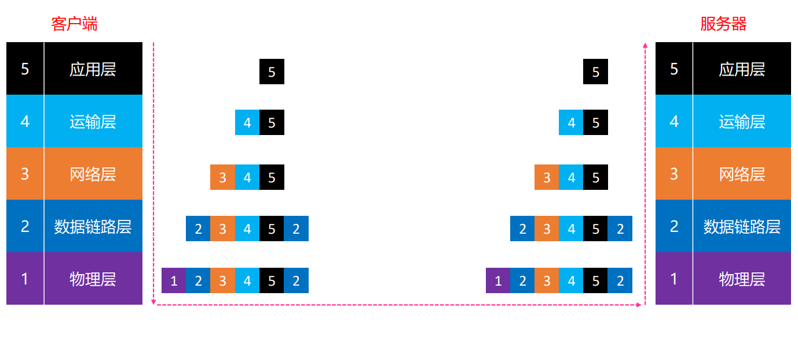
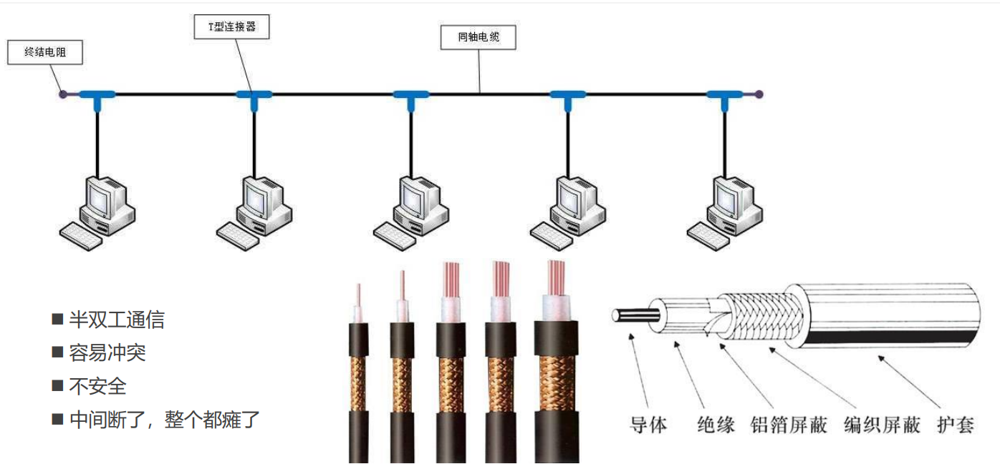
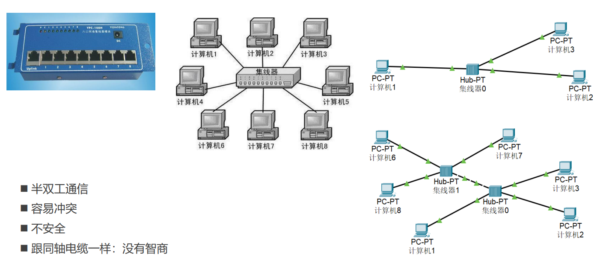
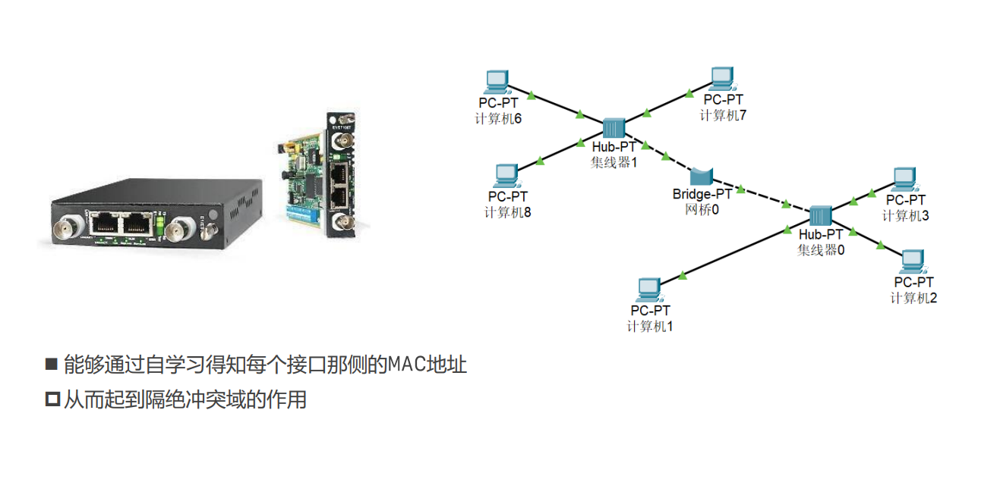
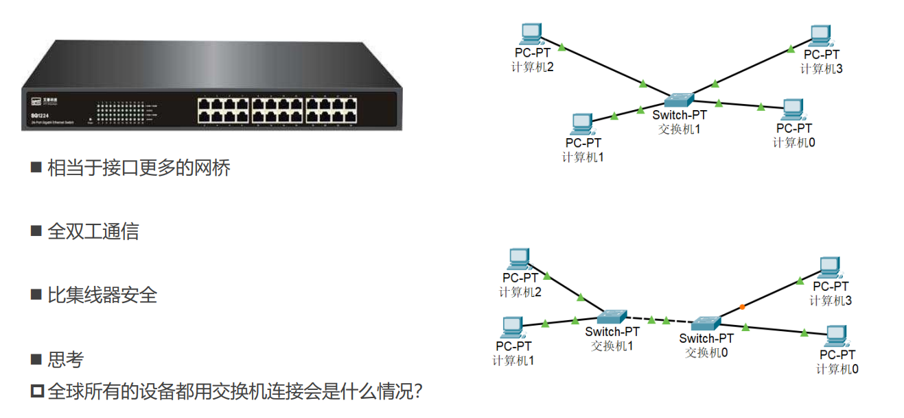
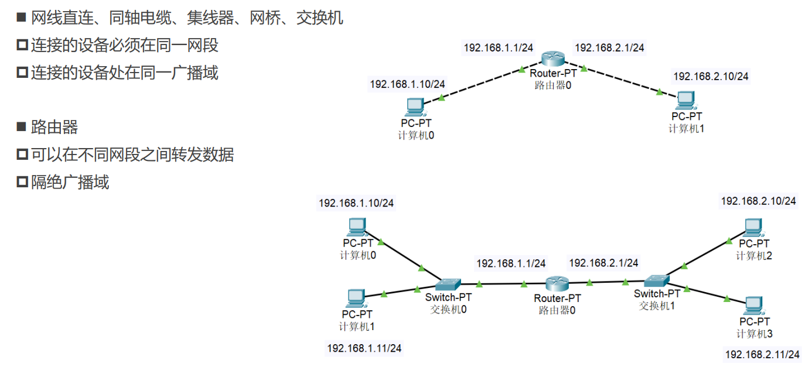

## 1.基本概念:
* 互联网(internet)
* 学习中需要搭建的环境
* 初步认识客户端-服务器
* Java的跨平台原理和C/C++的跨平台区别
--
* [ ] 网络协议
* [ ] 网络分层模型
* [ ] 网络请求过程
* [ ] 计算机之间的通信基础
* [ ] 计算机之间的连接方式
    1.网线直连
    2.同轴电缆(Coaxial)
    3.集线器(Hub)
    4.网桥(Bridge)
    5.交换机(Switch)
    6.路由器(Router)

---
#### 互联网:
*互联网与因特网的关系:*

>  什么是因特网?其一,我们能够描述因特网的具体构成,即因特网的基本硬件和软件组件;其二,我们能够根据分布式应用提供的联网基础设施来描述因特网.

*因特网(Internet)* :特指全球的,基于TCP/IP协议的互联网络,由无数网络通过路由器连接而成.
*互联网(internet)* :广义的"网络互联"概念,泛指通过协议将多个计算机网络连接而成的系统.

#### 学习中需要搭建的环境:
* 客户端-服务器开发环境
  1.客户端:浏览器(HTML+CSS+JS)
  2.服务器:Java
* 网络抓包
  1.浏览器(Chrome)
  2.Wireshark
* 模拟工具
  Packet Tracer

必装工具:JDK,IntelliJ IDEA Ultimate,Tomcat (搭服务器用)

#### 初步认识客户端-服务器:
客户端:移动开发(Android,ios)与嵌入式开发(C,C++,汇编)还有前端开发(HTML,CSS,Javascript)
服务器:接收客户端的请求数据然后返回数据.

#### Java的跨平台原理和C/C++的跨平台区别
1.java的跨平台原理:
* [ ] JVM(Java Virtual Machine):Java虚拟机
* [ ] Java的跨平台:一次编译,到处运行
* 编译生成跟平台无关的字节码文件(class文件)
* 由对应平台的JVM解析字节码为机器指令(01010101)
* [ ] 如果代码有语法错误,将编译失败,并不会生成字节码文件
* 那就不会去运行一个JVM程序.最后导致java程序运行失败.

2.C/C++的跨平台原理
* [ ] C/C++的跨平台:使用平台相关的编译器生成对应平台的可执行的代码

---
#### 网络协议(protocol)
网络协议类似于人类协议,只是交换报文和采取操作的实体是某些设备的硬件或者软件组件.在因特网中,涉及俩个或者多个远程通信实体的所有活动都受网络协议的制约.
> 协议(protocol) 定义了在俩个或者多个通信实体之间交换的报文的格式和顺序,
> 以及报文的发送/接收或者其他世界所采取的操作.

#### 网络分层模型
* [ ] 为了更好地促进互联网的研究和发展,国际标准化组织IOS在1985年制定网络互联模型
* [ ] OSI参考模型(Open System Interconnect Reference Model),具有7层结构

|   **OSI 参考模型** | **TCP/IP 协议** | **学习研究** |
|:---:|:---:|:---:|
|应用层(Application)|应用层(Application)|应用层(Application)|
|表示层(Presentation)|||
|会话层(Session)|||
|运输层(Transport)|运输层(Transport)|运输层(Transport)|
|网络层(Network)|网际层(Internet)|网络层(Network)|
|数据链路层(Data Link)  ||数据链路层(Data Link)|
|物理层(Physical)|网络接口层(Network Access)|物理层(Physical)|

我们在这讨论的主要是学习研究的分层:
|层|网络分层|主要协议|数据形式|
|:-:|:-:|:-:|:-:|
|5|应用层(Application)|FTP,HTTP,SMTP,DNS,DHCP|报文,用户数据|
|4|运输层(Transport)|TCP/UDP|段(Segments)|
|3|网络层(Network)|IP|包(Packet)|
|2|数据链路层(Data Link)|MAC|帧(Frames)|
|1|物理层(Physical)|.....|比特流(Bits)|

#### 网络请求过程

可以明显看到数据在每一层都存在一次封装,到达目标主机是又进行一层层解封.

#### 计算机之间的通信基础
* [ ] 需要得知对方的IP地址
* [ ] 最终是根据MAC地址(网卡地址),输送数据到网卡,被网卡接收
* 如果网卡发现数据的目标MAC地址是自己,就会将数据传递给上一层进行处理
* 如果网卡发现数据的,目标MAC地址不是自己的,就会将数据丢器,不会传递给上一层处理

#### 计算机之间的连接方式
1. 网线直连(需要用交叉线):
直通线:两端线序相同,用于连接不同类型的设备
交叉线:1-3,2-6对调,用于连接同类设备

2. 同轴电缆(Coaxial):
    特点:
   * [ ] 半双工通信
   * [ ] 容易冲突
   * [ ] 不安全
   * [ ] 中间断了,整个都不能使用
   
   它就相当于电线连接了多个计算机,每次只能允许一个计算机传递消息,并且消息会发给所有的计算机,这样效率和安全性极低,所有目前这种已经被淘汰了.

终结电阻属于是防止电信号重新弹回来,造成反复传送.

3. 集线器(Hub):
   * [ ] 半双工通信
   * [ ] 容易冲突
   * [ ] 不安全
   * [ ] 跟同轴电缆一样:没有智商
你可以理解为升级版的同轴电缆,俩者最显著的特征是集线器中其中一条线断了,不会影响其他计算机,如图.

4. 网桥(Bridge):
   * [ ] 能够通过自学得知每个接口那侧的MAC地址
   * [x] 从而起到隔绝冲突域的作用
  
  网桥主要通过源MAC地址学习来构建和维护其转发表:仅通过源MAC地址,不依赖目标MAC地址;转发表是动态的,适应网络拓扑变化;对于广播帧(如:ARP)或者未知目的MAC的帧,网桥会泛洪.

5. 交换机(Switch):
  * [ ] 相当于多个接口的网桥,但功能更高级
  * [ ] 全双工通信
  * [ ] 比集线器安全
  交换机工作在数据链路层,部分还支持网络层,能识别和处理MAC地址,具备智能转发能力;集线器工作在物理层,仅负责电信号的传输和放大.其实在我看来交换机也具备集线器的一些优点.
  

6. 路由器(Router)
   * [ ] 网线直连,同轴电缆,集线器,网桥,交换机
   * 连接的设备必须在同一网段
   * 连接的设备处在同一广播域
   * [ ] 路由器
   * 可以在不同网段之间转发数据
   * 隔绝广播域

我们在配置网关的时候也是在填路由器的IP地址,又路由器连接不同的网段.

