## 2.MAC地址和IP地址
* [x] 初识MAC地址
* MAC地址的表示格式
* MAC地址的查询与获取
* ARP广播与ICMP
 
- [x] 初识IP地址
- IP地址的组成
- IP地址的分类
- 子网掩码的CIDR
- 子网划分
   1. 为什么要进行子网划分
   2. 子网划分--等长子网划分和变长子网划分
- 超网
   1.  合并网段
   2.  合并网段的规律
---
#### 初识MAC地址
* [x] 每个网卡(不等于每台计算机,现在一台计算机有多个网卡)都有一个6字节(48bit)的MAC地址(Media Access Control Address)
* [x] 全国唯一,固化在了网卡的ROM中,由IEEE802标准规定
* 前3字节:OUI(Organizationlly Unique Identifier) ,组织唯一标识符(由IEEE的注册管理机构分配给厂商)
* 后3字节:网络接口标识符(由厂商自行分配) 

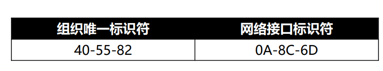
1. **MAC地址的表示格式**

   1. Windows : <u>40-55-82-0A-8C-6D</u>
   2. Linux,Android,Mac,iOS : <u>40:55:82:0A:8C:6D</u>
   3. Packet Tracer : <u>4055.820A.8C6D</u>
   4. 当48位为1时,代表广播地址 : <u>FF-FF-FF-FF-FF-FF</u> 
      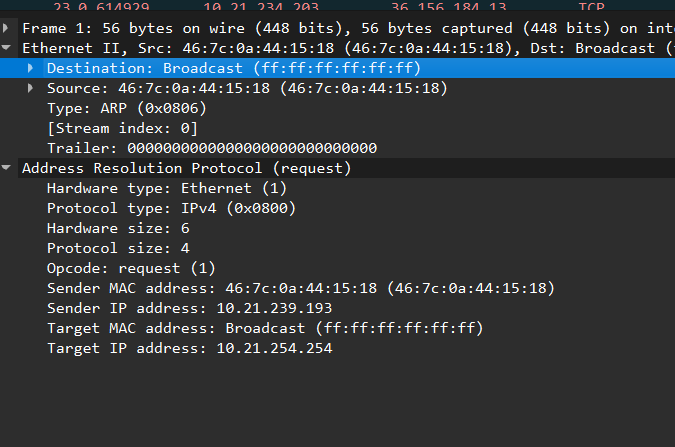
     
   * [ ] 查看自己主机所以网卡MAC地址的命令:ipconfig/all 
   * [ ] 也可以通过修改设置的MAC地址实现蹭网.(没试过,有机会试试)
  
2. **MAC地址的查询与获取**
   * [x] 当不知道对方主机的MAC地址时,可以通过发送ARP广播获取对方的MAC地址
   * [ ] 获取成功后,会缓存IP地址,MAC地址的映射信息,俗称: ARP缓存
   * [ ] 通过ARP广播获取的MAC地址,属于动态(dynamic)缓存(储存时间比较短,默认2分钟,过去自带删除)
   * [x] 相关命令
     * arp -a 主机地址  :查询ARP缓存
     * arp -d 主机地址  :删除ARP缓存
     * arp -s 主机地址 MAC地址:增加一条缓存信息(这是静态缓存,存储时间较久,不同系统的存储时间不同)
   
3. **ARP广播和ICMP**
   * [x] ARP(Address Resolution Protocol),译为:地址解析协议
     *  通过IP地址获取MAC地址
   * [ ] RAPP(Reverse Address Resolution Protocol),译为:逆地址解析协议
     *  使用与ARP相反,用于将MAC地址转换为IP地址
     *  后来被BOOTP,DHCP所取代

    * [x] ICMP(Internet Control Message Protocol),译为:互联网控制消息协议
      *  IPv4的ICMP被称作ICMPv4,IPv6中的ICMP则被称作ICMPv6
      *  通常用于返回错误信息:比如TTL值过期,目的不可达.
      *  ICMP的错误消息总是包括源数据并返回给发送者
  

#### 初识IP地址
***IP地址***:互联网上每一个主机都有一个IP地址
* 最初IPv4,32bit(4字节),2019年11月25日,全球的IP地址已经用完
* 后面推出了IPv6,128(16字节)

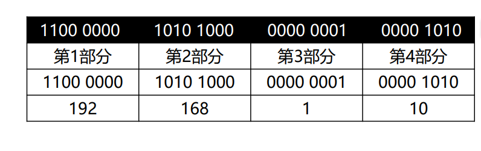
1. **IP地址的组成**
   * [x] IP地址由2部分组成:网络标识(网络ID),主机标识(主机ID)
   * 通过子网掩码(subnet mask) 可以得知网络ID,主机ID
   * [x] 主机所在的网段 = 子网掩码 & IP地址
   * 网段通常指一个逻辑或物理的子网络,由一组具有相同网络标识符的设备组成
   * 网段隔离广播域,安全控制(防火墙),优化路由  
2. **IP地址的分类**
   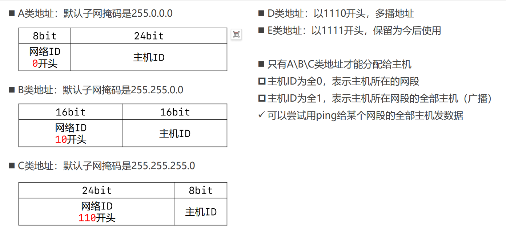
   - **A类地址**:
  
       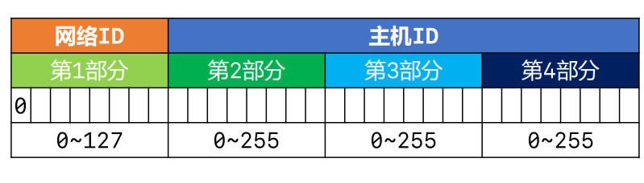
     * [x] 网络ID 
     * 0不能用,127作为保留网段,其中127.0.0.1是本地换回地址(Loopback),代表主机
     * 可以分配给主机的(第一部分的取值是:1~126)
     * [x] 主机ID
     * 第2,3,4部分的取值范围是: 0~255
     * 每个A类网络容纳的最大主机数:256\*256\*256-2=16777214
     * `为什么减2,因为全部为0是网段,全部为1是广播`
   - **B类地址**:
  
      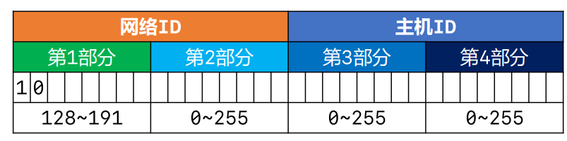
     * [x] 网络ID
     * 可以分配使用的
     * 第1部分的取值范围是: 128~191
     * 第2部分的取值范围是: 0~255
     * [x] 主机ID
     * 第3,4部分的取值范围是: 0~255
     * 每个B类网络能容纳的最大主机数是:256*256-2 = 65534
   - **C类地址**:
  
      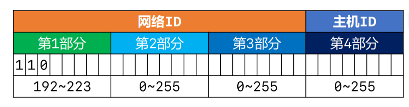
     * [x] 网络ID
     * 可以分配使用的
     * 第1部分的取值范围是: 192~233
     * 第2,3部分的取值范围是: 0~255
     * [x] 主机ID
     * 第4部分的取值范围是: 0~255
     * 每个C类网络最大容纳的最大主机数是: 256-2 = 254
   - **D类地址.E类地址**:
     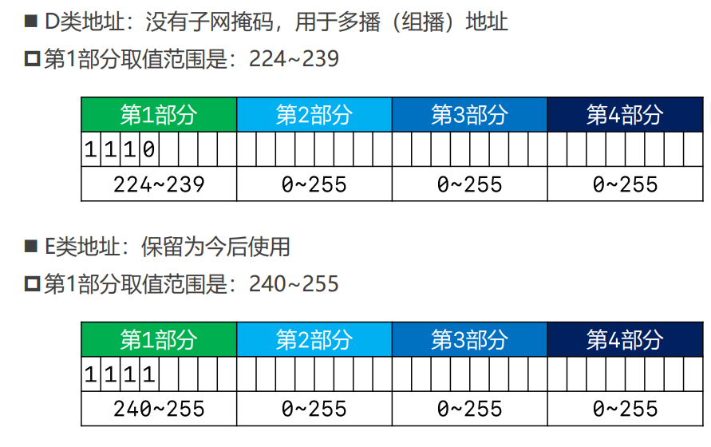
3. **子网掩码的CIDR**
   * [ ] CIDR(Classless inter-Domain Routing):无类别域间路由
   * [ ] 子网掩码的CIDR表示法
   * 192.168.1.100/24,表示子网掩码有24个1,也就是255.255.255.0
   * 123.210.100.200/16,表示子网掩码有16个1,也就是255.255.0.0 (思考有惊喜)
4. **子网划分**
   * 为什么要进行子网划分
     * 很简单的道理就是避免浪费
     * 比如500台主机对于C类网段254容量太大,对于B类的65534的容量太小.
   * 子网划分--等长子网划分和变长子网划分
     * **子网划分**:借用主机位作为子网位,划分出多个子网
     * [x] 可用分为:
         * 等长子网划分:将一个网段等分多个子网,每个子网的可用IP地址数量是一样的
         * 变长子网划分:每个子网的可以IP地址数量可以是不一样的
     * [x] 子网划分的步骤:
         * 确定子网的子网掩码长度
         * 确定子网中第1个,最后1个主机可用的IP地址 
    :smile: ==这里我们可以看到一个C类地址划分成俩个子网==->
     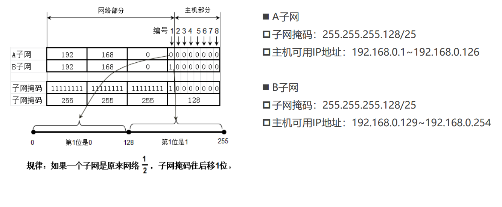
    :|==这里我们可以看到一个C类地址划分成四个子网==->
    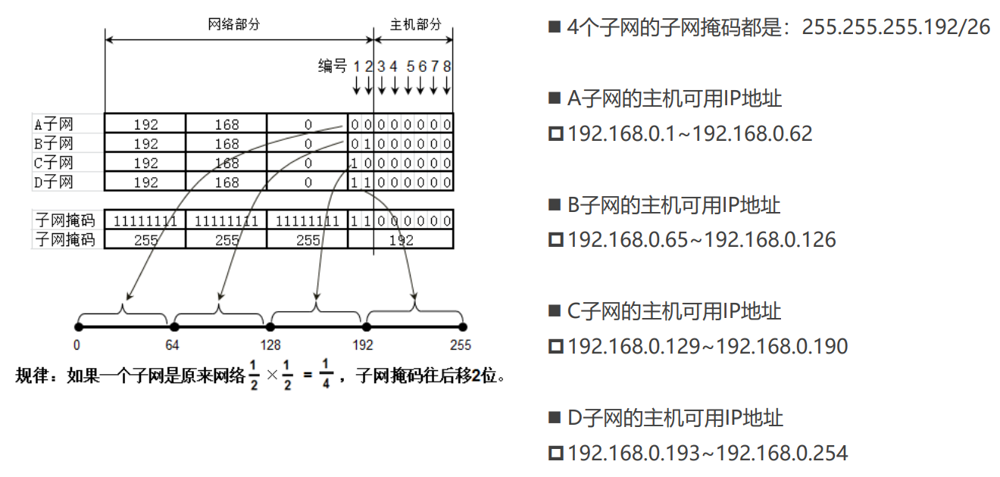
    :|==这里我们可以看到一个C类地址划分成八个子网==->
    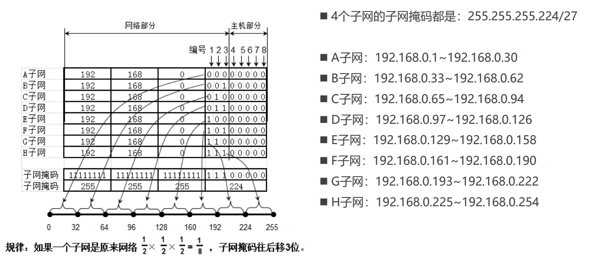
    :|==C类等分成4个子网的广播地址==->
    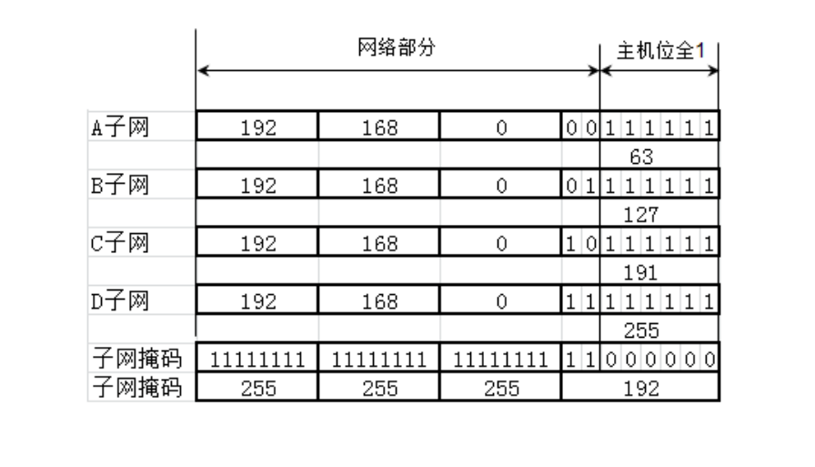
    ***同理***欣赏A类和B类 =>
    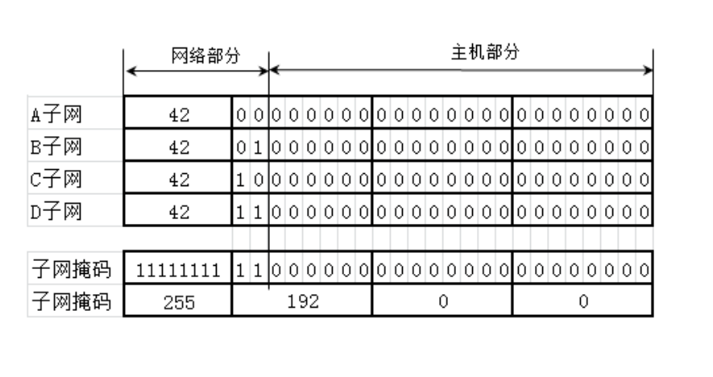
    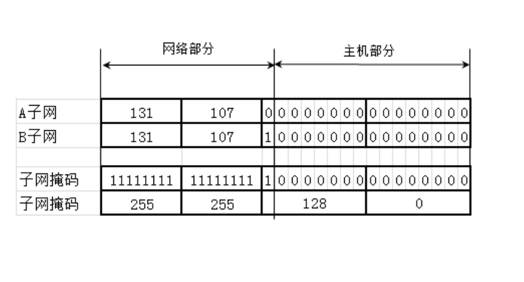
    `这俩张图片一个分别是A类划分4个等长子网,另一个是B类划分2个等长子网`
     * 了解一下网段划分变长子网:
      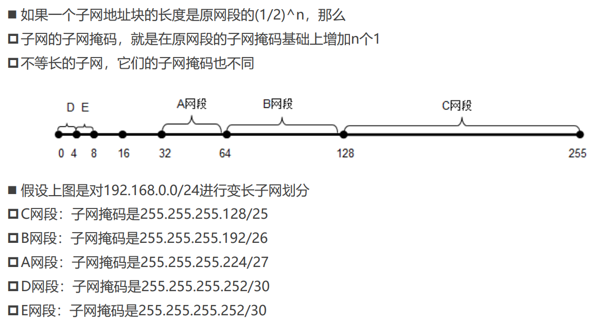

5. 超网
   * [x] 超网: 跟子网反过来,它是将多个*连续*的网段合并成一个更大的网段
   * [x] 需求: 原来有200台计算机使用192.168.0.0/24网段,现在希望增加200台设备到一个网段
   * 200台在192.168.0.0/24网段,200台在192.168.1.0/24网段
   * 合并192.168.0.0/24网段,192.168.1.0/24/24为一个网段: 192.168.0.0/23(子网掩码往左移动1位)
   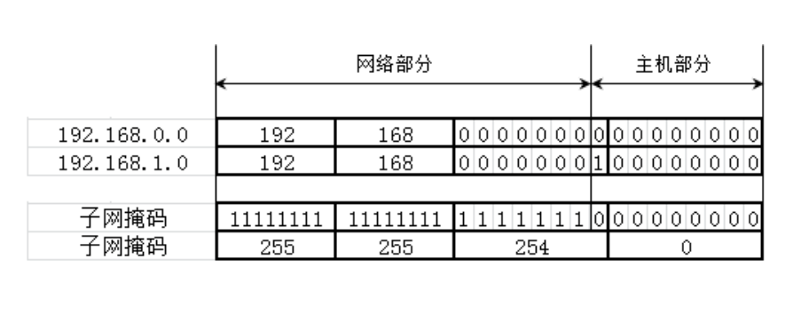
   1. **合并网段**
    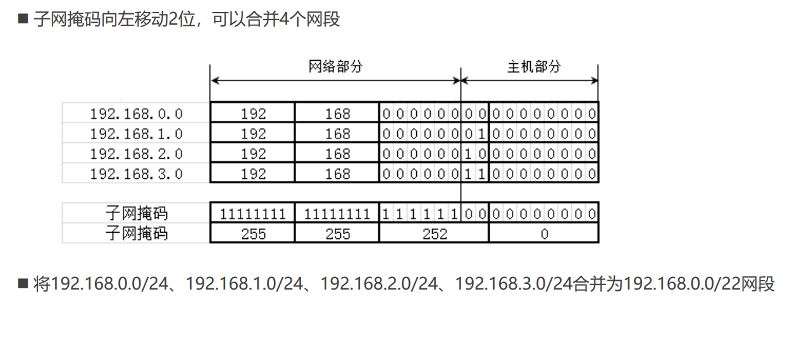
    思考下面的网段合并:
    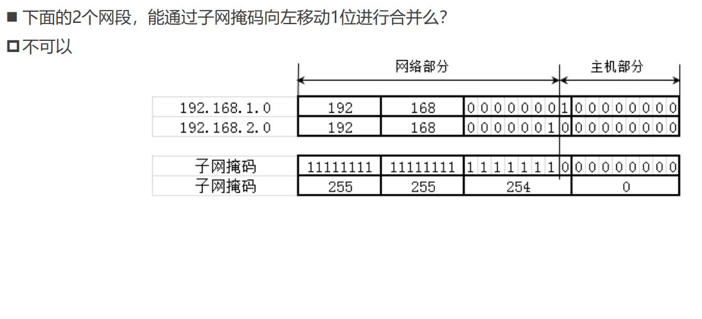
   2. **合并网段的规律**
   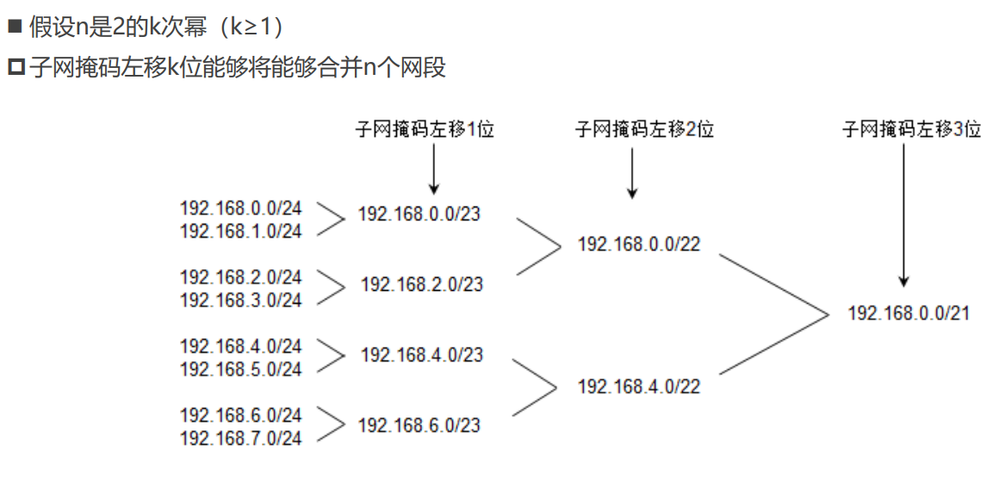
   假设N是2的K次幂(k大于等于1):
   如果第一个网段号能被n整除,那么由它开始的连续的n个网段,能通过左移k位子网掩码进行合并.
   * [x] 比如:
   * 第一个网段的网络号以二进制0结尾,那么它开始的连续2个网段,能通过左移1位子网掩码进行合并.
   * 第一个网段的网络号以二进制00结尾,那么它开始的连续4个网段,能通过左移2位子网掩码进行合并.
   * 第一个网段的网络号以二进制000结尾,那么它开始的连续8个网段,能通过左移3位子网掩码进行合并.
  
---
**在这部分我们已经介绍了MAC地址,IP地址(网段,子网,超网)**:
判断一个网段是子网还是超网:
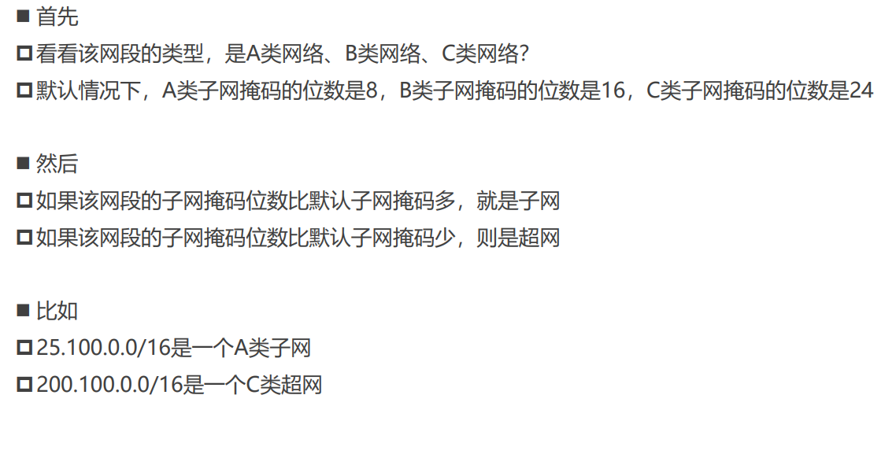

