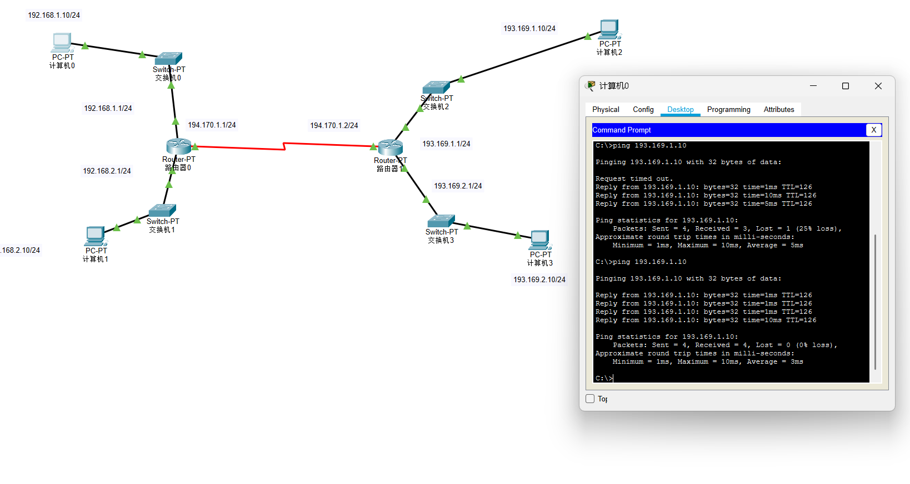

## 3.路由
* [x] 初识路由
* 静态路由与动态路由
* 静态路由的实例展示
* 路由表-4种路由形式
  * 特定主机路由
  * 网络路由
  * 默认路由
  * 汇总路由
  --
* [x] 琐碎知识
* 数据包的传输过程
* 网络,互联网,因特网
* ISP网络服务商
* 服务器机房
* 网络分类
* 常见的几种接口
* 上网方式-1.电话线入户 2.光纤入户 3.网线入户
* 家用无线路由器的逻辑结构
* 公网IP,私网IP,NAT


  ---
#### 初识路由
1. 在不同网段之间转发数据,需要有路由器的支持
2. 默认情况下,路由器只知道跟它直连的网段,非直连网段需要通过静态路由,动态路由告诉它
   * 静态路由:
     * 管理员手动添加路由信息
     * 适用于小规模网络
   * 动态路由:
     * 路由器通过路由选择协议(比如RIP,OSPF)自动获取路由信息
     * 适用于大规模网络
* [x] **静态路由和动态路由** :
  静态路由和动态路由是网络设备（主要是路由器）用来学习如何转发数据包到目标网络的两种基本方法。它们各有优缺点，适用于不同的场景。
  - **静态路由**

    1. 定义：
        *   由网络管理员**手动配置**到路由器的路由表条目。
        *   管理员明确指定数据包到达特定目标网络（或子网）需要发送到哪个**下一跳路由器接口**或**出站接口**。
        *   除非管理员再次手动修改或删除，否则这些条目**不会自动改变**。

    1.  配置方式:
        *   在路由器的命令行界面或图形化管理界面中，使用特定的命令输入目标网络地址、子网掩码和下一跳IP地址或出站接口。
        *   *示例命令 (思科风格)：* `ip route 192.168.2.0 255.255.255.0 10.0.0.2` 或 `ip route 192.168.2.0 255.255.255.0 Serial0/0`

    2.  优点：
        *   **简单：** 小型网络配置简单直观。
        *   **精确控制：** 管理员完全掌控流量路径。
        *   **无额外开销：** 路由器不需要运行路由协议进程，不消耗CPU、内存和带宽资源来交换路由信息。
        *   **安全性：** 不会意外学习到错误或不安全的路由。
        *   **可预测性：** 路径固定，便于故障排查和流量规划。

    3.  缺点：
        *   **管理负担重：** 在大中型或拓扑经常变化的网络中，手动配置和维护所有路由极其繁琐且容易出错。
        *   **缺乏适应性：**
            *   网络拓扑变化（如链路故障、新增路由器）时，**无法自动感知和更新**。管理员必须手动介入修改路由表，期间可能导致网络中断。
            *   无法自动选择最优路径或负载均衡（除非手动配置多条等价静态路由）。
        *   **扩展性差：** 只适用于小型、稳定的网络。

    4.  典型应用场景：
        *   小型办公室/家庭办公室网络。
        *   连接末节网络（只有一个出口的网络）。
        *   作为动态路由的补充（如配置默认路由`0.0.0.0/0`指向互联网出口）。
        *   需要强制流量走特定路径（如安全策略要求）。
        *   临时测试或故障诊断。

  * 动态路由

    1.  定义：
        *   路由器通过运行**动态路由协议**，**自动地**与其他路由器交换路由信息（如网络可达性、路径成本等）。
        *   路由器根据收到的信息，**自动计算**出到达目标网络的最优路径，并**动态更新**自己的路由表。
        *   当网络拓扑发生变化（如链路故障）时，路由器能**自动感知**并通过重新计算和交换信息来**收敛**到新的稳定状态。

    2.  配置方式：
        *   在路由器上启用所选的路由协议（如OSPF, EIGRP, RIP, BGP等）。猜猜属于哪一层
        *   配置协议参数（如进程ID、区域号、自治系统号、接口启用协议等）。
        *   路由器开始自动与邻居路由器建立邻接关系并交换路由信息。

    3.  优点：
        *   **自动化管理：** 极大减轻管理员负担，尤其在大中型网络中。
        *   **高适应性：**
            *   自动感知网络拓扑变化（链路故障、新增设备）。
            *   自动重新计算最优路径并更新路由表（收敛）。
            *   通常支持多条路径间的**负载均衡**。
        *   **扩展性好：** 适用于复杂、大型且拓扑可能变化的网络。
        *   **路径优化：** 路由协议通常内置度量值（如跳数、带宽、延迟、代价），能自动选择最优路径。

    4.  缺点：
        *   **复杂性：** 协议本身（配置、排错）比静态路由复杂，需要更深入的知识。
        *   **资源消耗：** 运行路由协议需要占用路由器CPU、内存资源；路由器之间持续交换路由信息会消耗带宽。
        *   **安全性风险：** 配置不当可能导致路由器学习到错误或恶意路由（需要配置认证等安全机制）。
        *   **收敛时间：** 网络变化后，所有路由器重新计算并同步路由信息达到一致状态需要一定时间，期间可能发生短暂的路由环路或数据丢失。
        *   **潜在次优路径：** 如果度量值设计不合理，可能选择非最优路径。

    5.  典型应用场景：
        *   中大型企业网络。
        *   数据中心网络。
        *   互联网服务提供商网络。
        *   任何拓扑复杂、链路冗余度高或可能发生变化的网络。

    核心区别总结

    | 特性         | 静态路由                       | 动态路由                           |
    | :----------- | :----------------------------- | :--------------------------------- |
    | **配置方式** | 管理员手动配置                 | 路由器自动学习（通过路由协议）     |
    | **维护方式** | 管理员手动更新                 | 路由器自动更新                     |
    | **适应性**   | 差（无法自动适应拓扑变化）     | 好（自动适应拓扑变化）             |
    | **管理开销** | 低（小型网络）-> 高（大型网络） | 初始配置复杂，后续维护开销低       |
    | **资源消耗** | 极低（无协议开销）             | 消耗CPU、内存、带宽（协议开销）    |
    | **扩展性**   | 差（仅适用于小型网络）         | 好（适用于中大型复杂网络）         |
    | **路径选择** | 管理员指定                     | 路由协议根据度量值自动计算最优路径 |
    | **安全性**   | 高（完全控制）                 | 需配置安全机制（如认证）           |
    | **收敛速度** | 无收敛概念                     | 有收敛时间（因协议和拓扑而异）     |
    | **典型协议** | 无                             | RIP, OSPF, EIGRP, IS-IS, BGP       |

    <u>*选择建议*</u>

    *   **优先选择静态路由：** 网络规模很小、拓扑极其稳定、有特殊路径控制需求、资源极度受限或需要最大程度减少协议开销时。
    *   **优先选择动态路由：** 网络规模中等以上、拓扑相对复杂、存在冗余链路、网络可能发生变化、需要自动故障切换和负载均衡时。

    <u>*实际网络中的结合使用*</u>

    在实际网络中，静态路由和动态路由**常常结合使用**：

    1.  末节网络的默认路由： 在连接到互联网或核心网络的边界路由器上，配置一条指向ISP或核心路由器的**静态默认路由**。内部路由器使用动态路由协议学习内部网络路径。
    2.  特殊路径控制： 对于需要强制走特定路径的流量（如安全审计、备份链路），配置静态路由覆盖动态路由学习到的路径。
    3.  浮动静态路由： 配置一条管理距离高于动态路由的静态路由，作为动态路由的备份路径。当动态路由失效时，静态路由生效。
    4.  路由重分发： 在不同路由协议域之间，或在静态路由与动态路由协议之间，相互引入路由信息。

    理解静态路由和动态路由的根本区别、优缺点以及适用场景，是设计和维护高效、可靠网络的基础。

* [x] **路由实例展示**

思考下列几个问题:
    * 计算机0与计算机1怎么通信?
    * 计算机0与计算机2怎么通信?
    * 计算机0与计算机3怎么通信?
  
    结合PacketTracer思考配置路由器的路由表:
    <u>**对于问题1:**</u>
     - **我们可以清晰的看到直连的网段是用的以太网接口,路由器在你连接接口配置时就已经将其记录到路由表里了,可以直接找到**
         
         

    <u>**对于问题2:**</u>
     - 首先我们要思考路由器和路由器连接是怎么配置的
     - 它们通过Serial接口连接:(你需要配置对应对应的路由器IP,与因特网接口一样)
     - 下方的图片展示的是路由器0配置`Serial2/0`,IP地址是路由器1的地址(掩码与上IP地址对应其网段)
     - 同理IP地址为194.170.1.2/24 的路由器1也需要配置`Serial2/0`为对应的路由器IP地址和掩码(路由器0):
        
        
     - 路由器与路由器配好之后,剩下就是配置路由表,让其路由器能够给另一个路由器转发:(这里是手动静态路由)
        
     - 为了计算机2能把消息传回计算机1,同理路由器1也需要配置静态路由表
        
        **这样我们通过(1)连接俩台路由器(2)配置静态路由表实现了跨网段通信**
        
     - 这里我们所配置的静态路由表是网络路由(还有特定主机路由,默认路由,汇总路由)
     - 最终用通俗易懂的语言就是连接俩个路由器,然后配置路由表,当你不知道193.168.1.0/24这个网段时,把这个包传给194.170.1.1,让它来寻找.
  
    <u>**对于问题3:**</u>
    - 与问题2一样,首先连接俩台路由器,然后配置静态路由表
    - 这里我们采用默认路由的形式配置:
      
    - 看看是否成功了
     
     - 当路由器0不知道这个IP对应的网段在哪的时候,全部转给路由器1,同理路由器1不知道这个IP对应的网段在哪的时候,全部转给路由器0.
  
     <u>关于这3个问题并没有从零开始配置,你需要给每台计算机配置网关以便数据能经过路由器后跨网段传递,然后路由器也要配置每个因特网接口的IP地址以便使其接口与其对应的计算机处于同一网段并接收数据</u>
     - 对于路由器0的路由表:
     - 对于路由器1的路由表:
  
    <u>**思考下面这俩这图:**</u>还可以用其他形式的路由表
    
    

* [x] **路由表-四种路由形式**
  这四类路由是路由表中常见的条目类型，它们在网络寻址和流量转发中扮演着不同的关键角色。以下是详细解释和对比：

    **1. 特定主机路由 (Host Route / Specific Host Route)**
    * **定义**：  
    指向**单个特定 IP 地址**（而非整个网络）的路由条目。  
    * **子网掩码**：  
    **`/32` (IPv4) 或 `/128` (IPv6)**，表示精确匹配一个主机地址（全 1 的掩码）。
    * **目的地址**：  
    单个主机的完整 IP 地址（如 `192.168.1.100/32`）。
    * **应用场景**：
    * **关键设备管理**：为服务器、路由器接口等提供独立于网络的精确路径控制。
    * **故障诊断**：临时强制流量测试路径。
    * **安全策略**：对特定主机实施特殊路由（如审计流量）。
    * **浮动静态备份**：为主机设置备用路径（通过调整管理距离）。
    * **示例配置**：  
    ```bash
    ip route 10.0.0.100 255.255.255.255 192.168.1.1  # IPv4
    ipv6 route 2001:db8::1/128 GigabitEthernet0/1     # IPv6
    ```

    **2. 网络路由 (Network Route)**
    * **定义**：  
    指向**一个子网或网络范围**的标准路由条目（最常见类型）。
    * **子网掩码**：  
    符合网络规划的掩码（如 `/24`, `/16` 等），覆盖一个地址段。
    * **目的地址**：  
    网络地址（如 `192.168.1.0/24`）。
    * **作用**：  
    将目标 IP **匹配到该网段的所有流量**转发至同一路径。
    * **示例**：  
    ```bash
    ip route 172.16.0.0 255.255.0.0 10.1.1.1   # 指向 B 类网络
    ```
    **3. 默认路由 (Default Route)**
    * **定义**：  
    当路由表中**无更精确匹配项**时使用的“最后 resort”路由。
    * **目的地址**：  
    **`0.0.0.0/0` (IPv4) 或 `::/0` (IPv6)**，匹配任何目标地址。
    * **应用场景**：
    * 连接 Internet 的边界路由器（指向 ISP）。
    * 末节网络（Stub Network）的唯一出口。
    * 简化内部路由器配置（内部用动态路由，出口用默认路由）。
    * **配置示例**：  
    ```bash
    ip route 0.0.0.0 0.0.0.0 203.0.113.1   # IPv4 默认网关
    ipv6 route ::/0 2001:db8::1            # IPv6 默认网关
    ```
    **4. 汇总路由 (Summary Route / Aggregated Route)**
    * **定义**：  
    将**多个连续子网**合并为一条更粗粒度的路由条目（减少路由表大小）。
    * **原理**：  
    利用 CIDR（无类域间路由）合并共享相同高位比特的连续网络。
    * **优势**：
    * **减少路由表条目**：提高路由器转发效率。
    * **降低更新开销**：动态路由协议传播更少条目（如 OSPF 区域间汇总）。
    * **隐藏拓扑变化**：下游网络变动不影响上游路由表。
    * **示例**：  
    将 `192.168.0.0/24` 到 `192.168.3.0/24` 汇总为 `192.168.0.0/22`：  
        ```
        192.168.0.0/24 → 11000000.10101000.000000|00.00000000
        192.168.1.0/24 → 11000000.10101000.000000|01.00000000
        192.168.2.0/24 → 11000000.10101000.000000|10.00000000
        192.168.3.0/24 → 11000000.10101000.000000|11.00000000
        汇总：192.168.0.0/22 → 11000000.10101000.000000|00.00000000 (前 22 位相同)
        ```
      * **配置**（OSPF 区域边界汇总）：  
      ```bash
      router ospf 1
      area 1 range 192.168.0.0 255.255.252.0  # 汇总 4 个 /24 为 /22
      ```

    **关键对比总结**:
    | **路由类型**       | **目的地址范围**   | **掩码长度**      | **主要用途**                     |
    |--------------------|--------------------|-------------------|----------------------------------|
    | **特定主机路由**   | 单个主机 IP        | `/32` (IPv4)      | 精确控制关键主机流量             |
    |                    |                    | `/128` (IPv6)     |                                  |
    | **网络路由**       | 一个子网/网络      | 如 `/24`, `/16`   | 标准网络流量转发                 |
    | **默认路由**       | **所有地址**       | `/0`              | 末节网络出口或“最后选择”         |
    | **汇总路由**       | **连续多个子网**   | **更短掩码**<br>(如 `/22` 覆盖 4×`/24`) | 简化路由表，优化协议性能 |

    **实际网络中的应用关系**:
    ```mermaid
    graph LR
        A[特定主机路由] -->|精确控制| D[路由器]
        B[网络路由] -->|常规转发| D
        C[默认路由] -->|兜底流量| D
        E[汇总路由] -.->|聚合多个网络路由| B

        D --> F[路由表]
        F --> G[转发决策：最长前缀匹配]
    ```

    **决策逻辑**：  
    路由器使用 **最长前缀匹配原则**（Longest Prefix Match）选择最优路径：
    1. 优先匹配 `/32`（特定主机）→ 其次 `/24`（网络）→ 最后 `/0`（默认路由）。  
    2. 汇总路由（如 `/22`）会覆盖其下的明细路由（如 `/24`），但**明细优先于汇总**。
    > 💡 **示例**：目标 IP `192.168.1.100` 的匹配顺序：  
    > 1. `192.168.1.100/32`（若存在）→ 2. `192.168.1.0/24` → 3. `192.168.0.0/22` → 4. `0.0.0.0/0`

    理解这些路由类型的区别和协作机制，是设计高效、可扩展网络架构的基础。

#### 琐碎知识
1. **数据包的传输过程(simple)**
    
    <u>这里我们发现,在每次传输的过程中MAC地址是变化的.其实在我们刚开始学习时就了解了使用ARP广播请求同一网段的目标主机的MAC地址,其实在互联网中对于不同网段中的目标主机,你并不知道它的MAC地址.你需要先把数据传递给网关,也就是路由器,路由器要接收数据,所以你的主机发送的数据中目标MAC地址应该是对应网关的目标地址.这里的其他数据,就是抽象的其他层的数据.</u>(以太网帧)
3. **网络,互联网,因特网**
   
4. **ISP网络服务商**
   * IPS(internet Service Provider)internet服务商,比如电信,移动,网通,铁通等
   * 我们平时拉的宽带都是通过ISP连接到Internet的
    
    
    其实ISP在网络的建设中作用贼大,因为他是以营利作为目的的,既可以提供良性竞争,又促进了网络普及和提升.
5. **服务器机房**
   
   这图也说明了*同一层*的ISP提供商是合作互联的,共同建立起强大的互联系统
   这点在计算机网络(自顶而下)中有深入讨论
6. **网络分类**
   * [x] 按照网络的范围进行分类,可以分为:局域网,城域网,广域网
   * [ ] 局域网(Local Address Network,LAN)
   * 一般范围在几百米到十几公里内的计算机所构成的计算机网络
   * 常常用于公司,家庭,学习,医院,机关,一栋大楼等
   * 局域网中使用最广泛的网络技术叫: 以太网(Ethernet)看到后面就明白这是什么了
   * 在电脑,手机上经常见到的一个英文WLAN(wireless LAN),意思是无线局域网
   * [ ] 城域网(Metropolitan Area Network,MAN)
   * 一般范围是数十公里到数百公里,可以覆盖一个城市
   * [ ] 广域网(Wide Area Network,WAN)
   * 一般范围是几百公里到几千公里,可以覆盖一个国家.通常都需要租用ISP的线路
7. **常见的几种接口**
   * FastEthernet(快速以太网100M):我们在PacketTrace的交换机和计算机连接中已经见过
   * GigabitEthernet(千兆以太网接口):看名字就是快
   * Serial(串行接口):我们可以看到路由器之间就是用的这个
8. **上网方式-1.电话线入户 2.光纤入户 3.网线入户**
    
    
    
    
    我们在这可以看到调制解调器的作用,了解WAN与LAN(现在基本上很少有电话线入户)
9.  **家用无线路由器的逻辑结构**
    
    很显然我们家用的就能算是一个网段了,绝大多数家庭都是私网.
10. **公网IP,私网IP,NAT**
    * [x] IP地址也分为: 公网IP,私网IP
    * [x] 公网IP (public)
    * Internet上的路由器中只有到达公网的路由表,没有到达私网的路由表
    *  公网IP由因特网信息中心统一分配和管理
    *  ISP需要向Inter NIC申请公网IP
    * [x] 私网IP (private)
    * 主要用于局域网.下面是保留的私网网段(公网**绝对不能**用这些IP)
    * A类:**10.0.0.0/8**(10.0.0.0-10.255.255.255):常用于大型企业
    * B类:**172.16.0.0/16**~**172.31.0.0/16**:16个连续的B类网
    * C类:**192.168.0.0/24**~**192.168.255.0/24**,256个C类网,常用于家用和小型办公网络
    * **它们不是全球唯一的,不能被分配给任何组织或者作为公网地址,不能在公网互联网上进行路由**
    * [x] NAT
    * 私网IP访问Internet需要进行NAT转换为公网IP
      * NAT(Network Address Translations)
      * 这一步可以由路由器来完成
    * NAT的特定
      * 可以节约公网IP资源
      * 会隐藏内部真实IP
    * NAT的分类
        * 静态转换
        ✓ 手动配置 映射表
        ✓ 一对一转换
        * 动态转换
        ✓ 定义外部地址池，动态随机转换
        ✓ 一对一转换
        * PAT(Prot Address Translation)最常用
        ✓ 多对一转换，最大程度节约公网 资源
        ✓ 采用端口多路复用方式，通过端口号标识不同的数据流
        ✓ 目前应用最广泛的 实现方式
---
| 特性         | 公网IP (Public IP)                 | 私网IP (Private IP)                  |
| :----------- | :--------------------------------- | :----------------------------------- |
| **范围**     | 全球互联网                         | 私有局域网内部                       |
| **唯一性**   | **全球唯一**                       | **仅在所属局域网内唯一**             |
| **分配者**   | ISP (来自IANA/RIR)                 | 本地路由器 (DHCP) 或 管理员          |
| **费用**     | 通常需付费租用                     | 免费                                 |
| **数量**     | 有限 (IPv4) / 庞大 (IPv6)          | 庞大 (可重用)                        |
| **直接访问互联网** | 是                                 | **否** (需通过NAT网关)               |
| **被互联网直接访问** | 是                                 | **否** (需NAT端口映射/穿透)          |
| **主要用途** | 互联网设备间通信，托管公共服务     | 局域网内设备间通信                   |
| **安全性**   | 暴露在外，风险较高                 | 有NAT隔离，相对更安全                |
| **常见地址段** | 非保留段皆可能 (如 1.2.3.4)       | `10.0.0.0/8`, `172.16.0.0/12`, `192.168.0.0/16` |
| **例子**     | 你的路由器从ISP获得的地址，网站服务器的地址 | 你家里的电脑、手机、打印机获得的地址 (192.168.1.x) |
 
 **NAT（网络地址转换）是核心：**
    *   正因为家庭内部是私网，而路由器拥有公网IP，它们之间就需要 **NAT** 技术来桥接。
    *   当你的手机（私网IP，如 192.168.1.5）访问百度（公网IP）时：
        1.  手机发送请求到路由器。
        2.  路由器**将源IP地址**从手机的私网IP (192.168.1.5) **替换成**路由器自己的公网IP (例如 120.230.150.100)，并记录下这个转换关系（哪个内网设备、哪个端口发出的请求）。
        3.  请求以路由器公网IP (120.230.150.100) 为源地址发送到互联网，到达百度服务器。
        4.  百度服务器将响应发送回路由器的公网IP (120.230.150.100)。
        5.  路由器根据之前记录的转换关系，**将目标IP地址替换回**手机的私网IP (192.168.1.5)。
        6.  路由器将响应转发给你的手机。
    *   这样，家里所有设备（可能有几十台）都通过**这一个（或少量）公网IP地址**访问了互联网，大大节省了宝贵的IPv4公网地址资源。

  ---
 **私网内部完全可以再建立私网**，这就是常说的“私网套私网”或“多层NAT（NAT嵌套）”的网络结构。这在现实中很常见，尤其是在企业网络、大型机构或复杂的家庭/办公网络环境中。
 **为什么会出现“私网套私网”？**
1. **分层管理需求**  
   - 大型企业可能按部门划分子网，部门内部再进一步划分。
   - 家庭中可能因扩展Wi-Fi覆盖或隔离设备（如智能家居网络），在主路由下接入了二级路由器。
2. **地址复用**  
   - 不同层级的私网可使用相同的私网IP段（如 `192.168.1.0/24`），只要在同一层级内不冲突即可。
3. **安全隔离**  
   - 子网之间可通过路由器或防火墙隔离，提升安全性（如财务部网络与研发部网络隔离）。
 **典型场景示例**
家庭网络中的“私网套私网”
        ```
        互联网
        │
        └── 主路由器 (公网IP: 120.230.150.100, 私网IP: 192.168.1.1)
            │
            ├── 电脑A (IP: 192.168.1.100)  --【一级私网】
            │
            └── 二级路由器 (WAN口IP: 192.168.1.200, LAN口IP: 10.0.0.1)
                │
                ├── 手机B (IP: 10.0.0.101)  --【二级私网】
                └── 智能电视 (IP: 10.0.0.102) 
        ```
- **层级关系**：
  - **一级私网**：主路由器创建的 `192.168.1.0/24` 网络。
  - **二级私网**：二级路由器创建的 `10.0.0.0/24` 网络（嵌套在一级私网内）。

 **通信规则与挑战**
1. **内层 → 外层/互联网（可行）**  
   - 二级私网中的设备（如手机 `10.0.0.101`）访问互联网时：
     - 数据包先经过二级路由器的 **NAT**（源IP从 `10.0.0.101` → `192.168.1.200`），
     - 再经过主路由器的 **NAT**（源IP从 `192.168.1.200` → `120.230.150.100`）。
   - **结果**：互联网看到的源IP是主路由器的公网IP。
   - ✅ 可正常上网，但性能可能因多层NAT下降。

2. **外层 → 内层（默认不可达）**  
   - 一级私网的设备（如电脑 `192.168.1.100`）**无法直接访问**二级私网的设备（如手机 `10.0.0.101`）。
   - **原因**：  
     - 主路由器不知道 `10.0.0.0/24` 网络的存在（它只认识直连的 `192.168.1.0/24`）；
     - 二级路由器的WAN口屏蔽了内网广播，且默认拒绝外部主动访问。
   - ❌ 需要手动配置 **端口转发** 或 **DMZ** 才能打通（复杂且不安全）。

3. **跨同级私网（需路由支持）**  
   - 若主路由器下挂多个二级路由器（如 `Router A` 和 `Router B`），它们之间的设备默认无法互通。
   - **解决方案**：关闭二级路由器的NAT功能，将其改为 **“交换机/AP模式”** 或配置 **静态路由表**。
  
**潜在问题**
1. **性能损耗**  
   多层NAT会增加数据包处理延迟，影响游戏/UDP应用（如视频通话、P2P下载）。
2. **配置复杂化**  
   - 端口映射需在每一层路由器上逐级设置（例如将互联网请求转发到二级私网的摄像头）。
3. **IP地址冲突风险**  
   - 若子网规划不当，可能出现重复IP段（如两个二级路由器都用 `192.168.1.0/24`）。
4. **服务访问困难**  
   - 内网设备难以被外部访问（如搭建网站、远程控制NAS），需依赖内网穿透工具（如frp、Tailscale）。


 **如何优化“私网套私网”？**
| **场景**               | **推荐方案**                     | **效果**                              |
|------------------------|----------------------------------|---------------------------------------|
| 家庭扩展网络           | 将二级路由器设为 **AP模式**      | 所有设备在同一层私网，互通无障碍      |
| 企业多部门隔离         | 使用三层交换机+**VLAN**划分      | 逻辑隔离子网，无需多层NAT             |
| 远程访问内网设备       | 配置 **端口映射** 或 **VPN**     | 逐级映射或通过VPN直接接入内网         |
| 避免地址冲突           | 统一规划私网IP段（如 `10.0.0.0/8`） | 层级间使用不同子网（如 `10.1.0.0/16`→`10.2.0.0/16`） |

 **关键结论**
- **可以嵌套**：私网内部再建私网技术上完全可行（NAT嵌套）。
- **慎用场景**：家庭网络建议简化结构（多用AP模式），企业网络建议用VLAN替代物理嵌套。
- **IPv6是终极方案**：IPv6地址充足，可让每个设备直连公网，彻底避免NAT层级问题（但需安全策略配合）。

> **比喻**：私网套私网就像一栋大楼里划分多个保密部门。  
> - 外层部门（一级私网）寄信需写明楼层（IP段）；  
> - 内层部门（二级私网）的信件需由保密室（二级路由器）转交，且外部无法直接寄入内层。  
> 只有通过特定手续（端口映射/VPN）才能跨部门通信。
