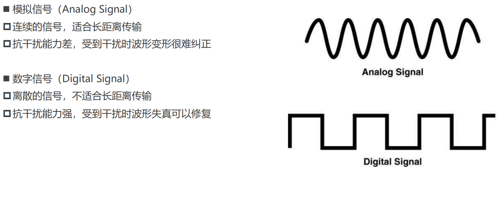
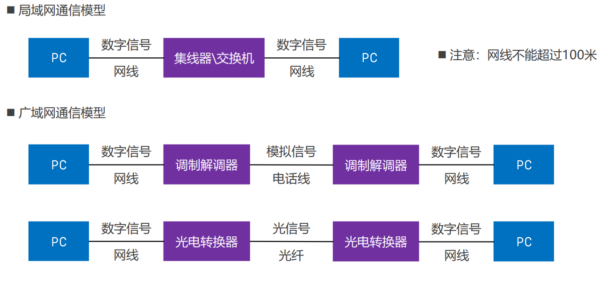

## 物理层和数据链路层
* [x] 物理层
* 再次回忆网络互联模型
* 再次回忆请求过程
* 再次回忆网络分层
* 数字信号,模拟信号
* 数据通信模型
* 信道的理解
* [x] 数据链路层
* 初识数据链路
* 数据链路层的3个基本问题:
  * 封装成帧
  * 透明传输
  * 差错检验
* CSMA/CD协议,以太网帧
* PPP协议
* 网卡

---
#### 物理层
    物理层定义接口的标准,线缆标准,传输速率,传输方式等(是最底层)

1. **回忆网络互联模型**
   
   我们学习使用的就是第3个.
2. **回忆请求过程**
   
   我们再次发现在数据的传输中进行了大量的封装和解包,每一层都提供了数据.
   分层的最大的好处就是便于维护和升级.世界在短时间不会再改变这个分层.
3. **回忆网络分层**
   
   刻在DNA上了,属于是.哈哈哈
4. **数字信号,模拟信号**
   
   这里其实我觉得有意思的是:模拟信号抗干扰差但能长距离传输,数字信号相反,这不是有点难受,不能同时具备俩种优点.虽然早就知道了关于波的特点,还是感觉对于这点有点惋惜.
5. **数据通信模型**
   
   网线不能超过100米,电话线和光纤可以.
6. **信道的理解**
   * [x] 信道:信息传输的通道,一条传输介质上(比如网线)上可以有多条信道
   * [x] 单工信道
   * 信号只能往一个方向传输,任何时候都不能改变信号的传输方向
   * 比如无线电广播,有线电视广播
   * [x] 半双工通信
   * 信号可以双向传输,但必须是交替进行,同一时间只能往一个方向传输.
   * 比如对讲机,我们前面学的集线器,同轴电缆
   * [x] 全双工通信
   * 信号可以双向传输
   * 比如手机(打电话),我们前面学的交换机

#### 数据链路层
* [x] **初识数据链路**
    
    * 链路:从一个节点到相邻节点的一段物理线路(有线或无线),中间没有其他交换节点.
    * 数据链路:再一条链路上传输数据时,需要有对应的通信协议来控制数据的传输.
    * 交换机虽然不改变数据信息,但它识别处理转发数据,算作一个节点.实际如图所示,交换机0和计算机以及路由器2的传送的数据是不变的.
    * 集线器就不同了,但相对于单纯的网线,但计算机0与集线器0和集线器0与路由器和交换机0与路由器2和交换机0和计算机1,这4条线是同一类型的数据链路,其实它们用的协议都是以太网帧,是一样的.
    * 不同类型的数据链路传输数据时,所用的通信协议可能是不同的
      * 广播信道: CSMA/CD协议(比如同轴电缆,集线器等组成的网络)(网络边缘)
      * 点对点信道: PPP协议 (比如路由器之间的信道)(网络核心) 
1. **数据链路层的3个基本问题**:
      不管你是什么类型的数据链路,都基于这3个问题
  * 封装成帧
      
     *  帧(Frame)的数据部分:就是网络层传递下来的数据包(IP数据包,Packet)
     *  最大传输单元MTU(Maximum Transfer Unit):
        * 每种数据链路层协议都规定了所能够传输的帧的数据长度上线
        * 以太网的MTU为1500个字节  
  * 透明传输
     
      
    *  我们可以清楚的看到在传输过程中对于如何识别俩段的处理过程
  * 差错检验
      
      * FCS是根据数据部分+首部计算得出来的.
        * FCS如果在传播过程中出现问题,在数据传输到网卡(路由器有网卡)时,会重新算一遍,发现俩者不匹配就会丢弃.
        * 如果是数据有问题,同理会被丢弃.
        * 如果俩者都有问题,那么还是会被丢弃.(你同时出问题,刚好成立概论太小了)  
2. **CSMA/CD协议,以太网帧**
   * CSMA/CD(Carrier Sense Multiple Access with Collision Detection):载波侦听多路访问/冲突检查--**侦听多路,冲突检查**
   * 使用CSMA/CD的网络可以称为以太网(Ethernet),它传输的是以太网帧
     * 以太网帧的格式有:Ethernet V2标准,IEEE的802.3标准
     * 使用最多的是:Ethernet V2标准 
   * 为了检测正在发送的帧是否产生了冲突,以太网的帧至少要64字节(或许你想知道为什么是64字节,这里首先会涉及传输延迟,传播延迟,处理延迟,排队延迟的计算.我尝试着查略资料,计算了一下.这里就不给出过程了)
   
   
   通过者俩张图我们也可以清楚的意识到上面3个基本问题(后面会抓包分析的)但以太网帧并没有显示的开始和结束符
3. **PPP协议**
   请看下面PPP协议帧:
   
   
   <u>**不知道大家是否注意到:PPP协议帧和以太网帧其实格式是大差不差的.**
   这里更清晰的说明俩种协议帧的应用:
   * 对于以太网帧,其实主要用于同一网段,本质上就是他们的网络接口都是以太网.
   * 对于PPP协议帧,其实几乎用于串口serial也就是路由器直连.
   </u>

      总结：协议取决于接口类型
      | **连接方式**               | **链路层协议** | **FCS 处理**                              |
      |---------------------------|---------------|------------------------------------------|
      | 路由器↔路由器（串行接口）   | PPP/HDLC      | 按 PPP 的 FCS 校验和重新计算              |
      | 路由器↔路由器（以太网接口）| 以太网        | 重新计算以太网 FCS                        |
      | 路由器↔交换机              | 以太网        | 交换机校验 FCS，路由器转发时重新计算 FCS  |
4. **网卡**
   分析wireshark开始界面，然后发现里面抓到的包对应的桢的结构，然后观察分析为什么协议目标主机不同，前面的桢都相同，因为你要走网关。
   这里我们抓到的全部是以太网桢，懂的都懂。
   wireshark不会抓到fsc因为，fcs在上传到过程中使用就丢弃了，所以wireshark没有拿到fcs，那我们可以猜到wireshark监听是在数据链路层和网络层之间，网卡处理后。
   我们知道网卡是俩层，交换机是2层，集线器是1层，路由器是3层(有些4层)
   

   ---
   补充一个wireshark操作:

   
   
   这里侦听了你的网卡流量,loopback就是回环的意思,就好比你访问你本地主机
   我这里打开WLAN:
   
   
   我们可以清楚的看到这个数据包每个部分对应的信息,就如前面介绍的一般,前面是俩MAC,后面是类型,然后是来自网络层的IP包.
   如果你再仔细分析会发现FCS它是没有拿到的,那个以太帧物理层插入的8个字节也没有.
   