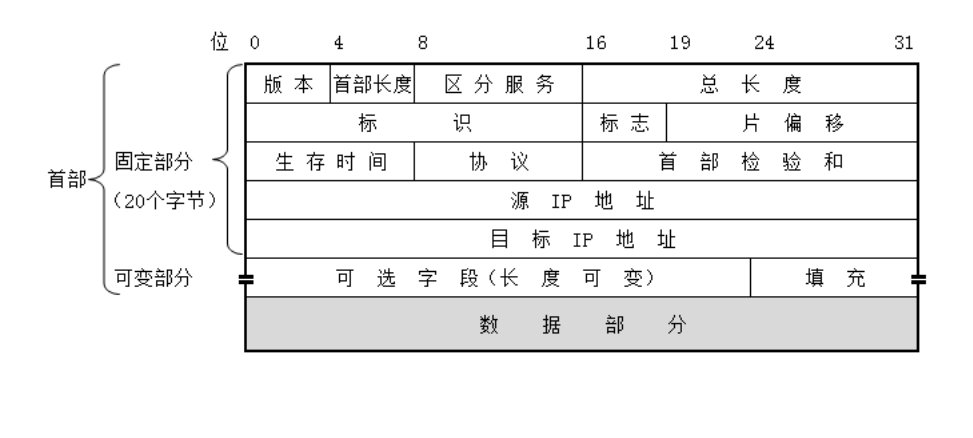
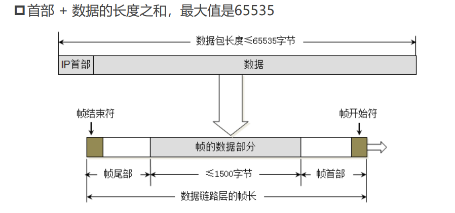
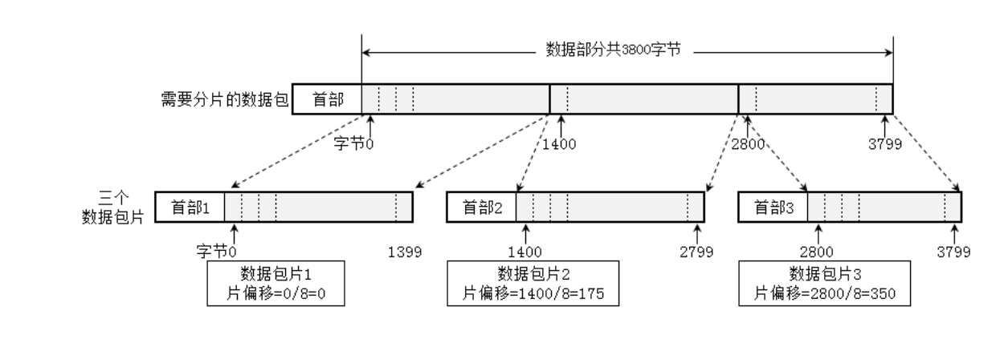
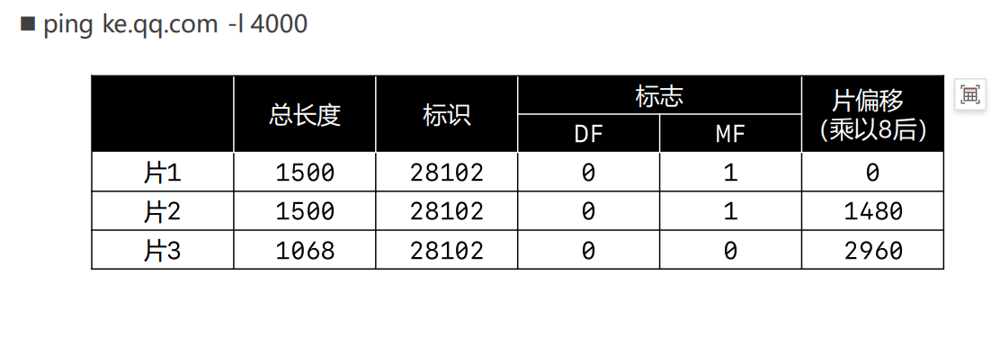
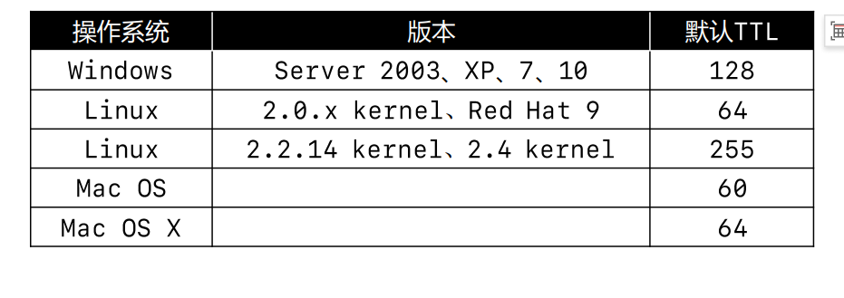
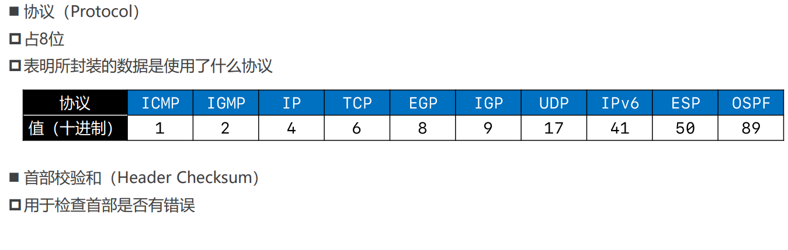
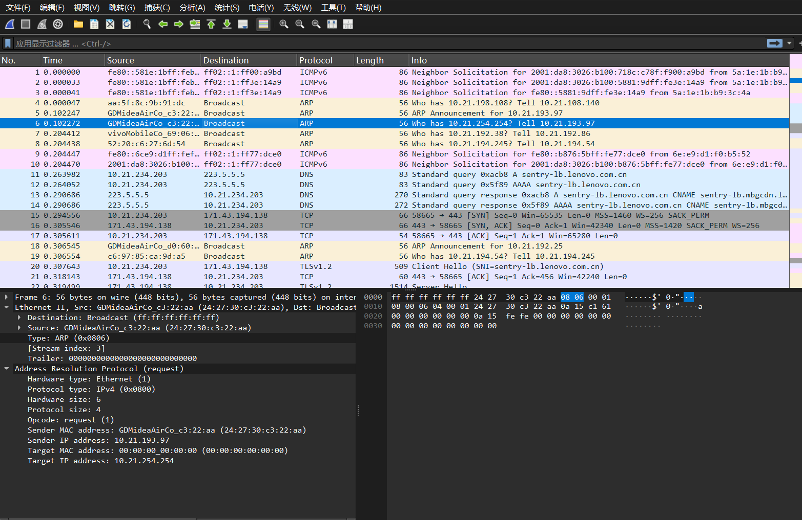
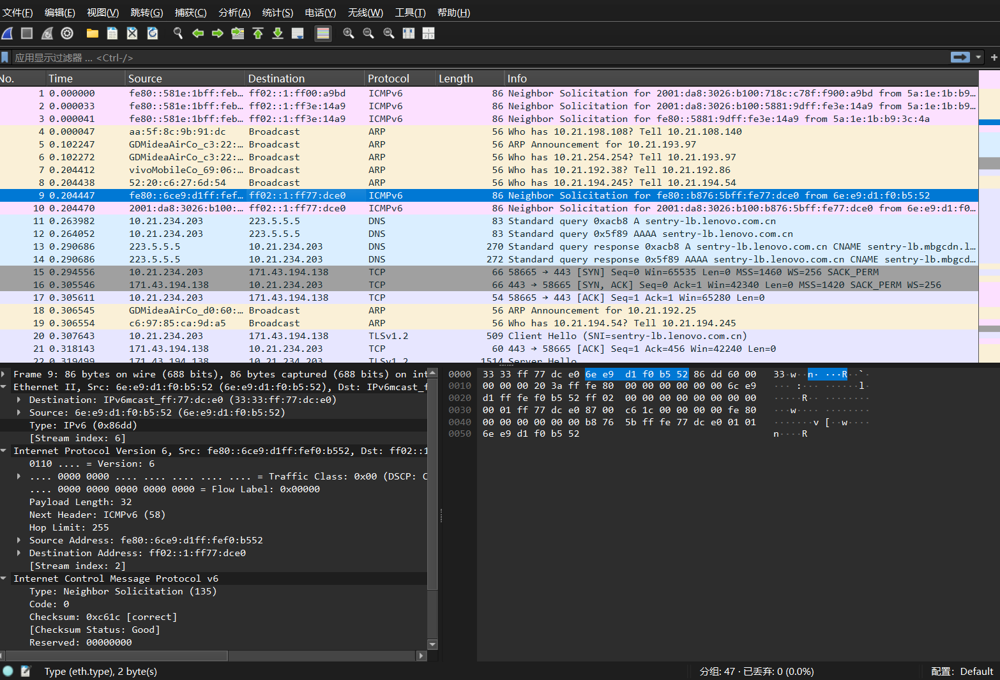
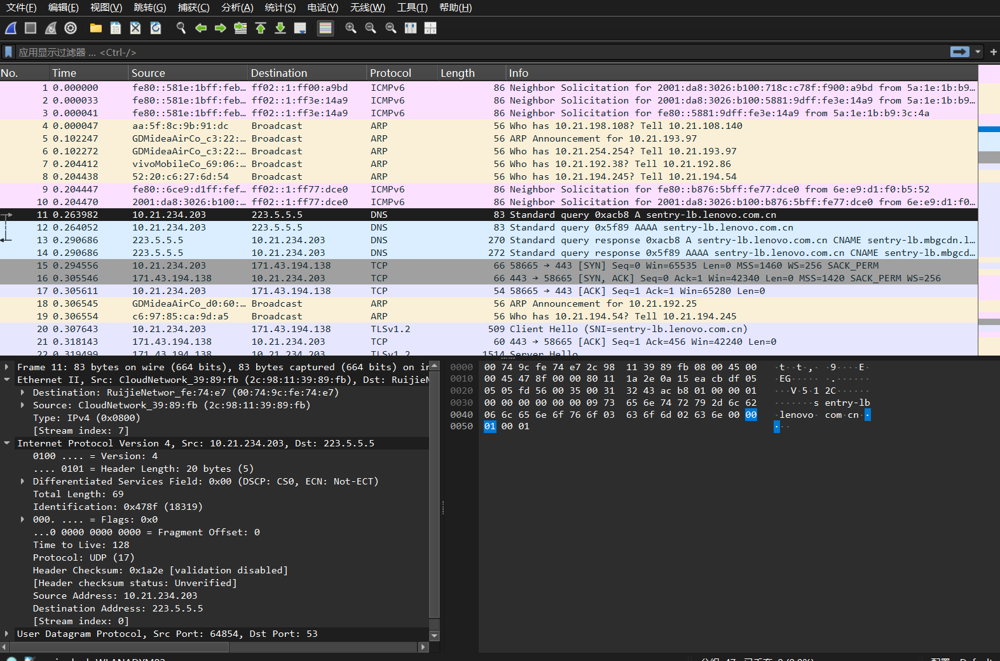

## 网络层
*  整体初识网络层
*  网络层首部
   * 版本,首部长度,区分服务
   * 总长度  
   * 标识,标志,ping的常见用法
   * 片偏移
   * 生存时间
   * 协议,首部校验和
* 网络层数据部分
   * ARP,ICMP,IP 
  
---
#### 初识网络层:
* [x] 网络层数据包(IP数据包,Packet)由首部和数据俩部分组成
* [ ] 数据部分**很多**时候是传输层传递下来的数据段(segment)

我们发现首部有:<u>版本,首部长度,区分服务,总长度,标识,标志,片偏移,生存时间,协议,首部校验和,源IP地址和目标IP地址已经可变字段</u>.
思考:为什么数据链路层已经有类型了,但是网络层的包还要交代一遍版本?
找到一个通俗易懂的解释:我们在数据链路层和网络层设置对数据包的解读,方便计算机拆包处理数据.我们在数据链路层的类型既可以是IPv4,IPv6也可以是ARP(在OSI规定中ARP属于数据链路层)所以数据链路层的类型不一定是IP版本,同样在网络层有着协议部分也告诉计算机它的数据部分储存的什么协议格式.--当学到传输层你又发现它没有对上层协议的说明,为什么?传输层再谈.
#### 网络层首部
1. **版本,首部长度,区分服务**
   * 版本(Version):
     * 占4位
     * 0b0100->IPv4
     * 0b0110->IPv6
   * 首部长度(Hearder Length):
     * 占4位,二进制乘以4才是最终长度
     * 0b0101->20(最小值)
     * 0b1111->60(最大值)
   * 区分服务(Differentiated Services Field)
     * 占8位
     * 可以用于提高网络的服务质量(Qos,Quality of Service)  
2. **总长度**
 
 * 总长度(Total Length)
   * 占16位
   * 首部+数据的长度之和,最大值是65535
 *  由于帧的数据不能超过1500字节,所以过大的IP数据包,需要分成片(fragments)传输给数据链路层,且每一片都有自己的网络层首部(IP首部)
1. **标识,标志,ping的常见用法**
    * 标识 (Identification)
      * 占16位
      * 数据包的ID,当数据包过大进行分片时,同一个数据包的标识都是一样的 
      * 有一个计数器专门管理数据包的ID,每发出一个数据包,ID就加1.
    * 标志(Flags)
      * 占3位
      * 第1位 (Reserved Bit) : 保留
      * 第2位 (Don't Fragment) : 1代表不允许分片,0代表允许分片
      * 第3位 (More Fragment) : 1代表不是最后一片,0代表是最后一片
    * ping - 几个用法
      *   `ping /?`:查看ping的用法
      *   `ping ip地址 -l 数据包的大小`:发送指定大小的数据包
      *   `ping ip地址 -f`:不允许网络层分片
      *   `ping ip地址 -i TTL`:设置TTL的值
    * 通过Tracert,pathping命令,可以跟踪数据包经过那些路由器   
2. **片偏移**
  
  
  * 片偏移 (Fragment Offset)
    * 占13占
    * 片偏移乘以8:字节偏移
    * 每一片的长度一定是8的整数倍 
1. **生存时间**
   * 生存时间(Time To Live,TTL)
     * 占8位
     * 每个路由器在转发之前会将TTL减1,一旦发现TTL减0,路由器会返回错误报告
     * 观察使用ping命名之后的TTL,能够推断出对方的操作系统,中间经历了多少路由器

  
1. **协议,首部校验和**

这里的协议代表数据部分所用的协议.

#### 网络层的常见协议
仔细研究一下ARP,ICMP和IP协议

1. 我认为ARP还是属于数据链路层,但它确实和IP有关系.
2. 还记得最上面说的大多数的网络层数据来自传输层吗?ICMP就是那个少数,网络层有自己的协议,这里封装的ICMP就是很好的例子,Protocol里是ICMPv6,数据部分是ICMP的格式.但我它为什么封装到我的网络层IP协议里了?是不是又有点像传输层协议.
3. IP协议就是我们上面说的格式.
**大多数网络层协议都封装到网络层IP协议里**
(如果按照其他的模型,ARP属于网络层,那就是我们这句话的一个典型特例.)

这里的笔记其实大部分属于我自己的思考,很多都带有主观性且一些主要的实例和细节,我并没有记录,因为这是我笔记不是教学.

