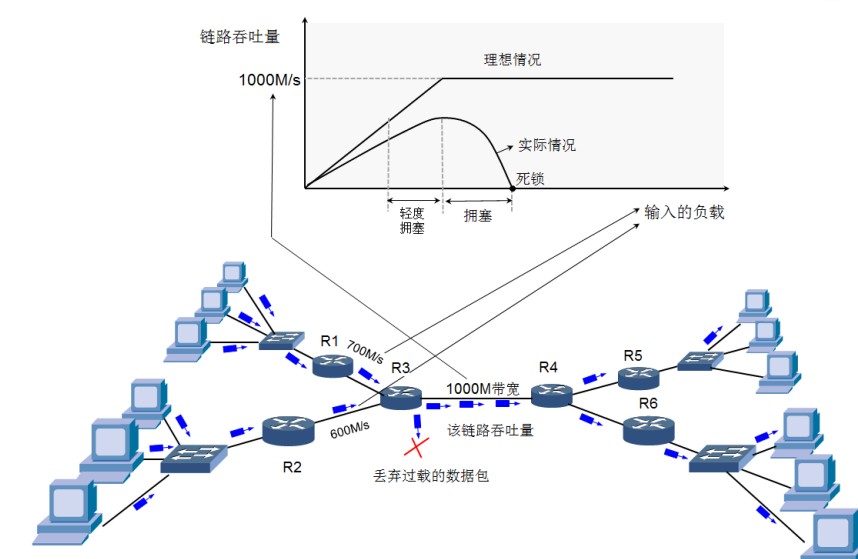
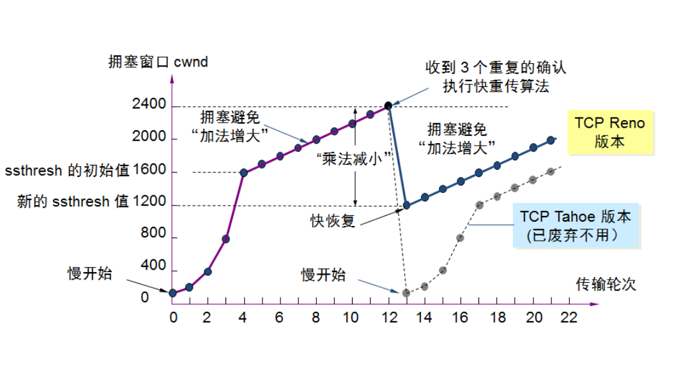

## 传输层
* [x] 初识传输层的俩个协议
* [x] UDP(Transmission Control Protocol)
   * 数据格式
   * 校验和
   * 端口
* [x] TCP(User Datagram Protocol)
   * 数据格式以及俩个细节
   * 检验(checksum)和数据偏移(data offset)
   * 标志位(Flags)
   * 序号(Sequence Number),确认号(Acknowledge Number),窗口(Window)
   * TCP的4大要点
     * 可靠传输
     * 流量控制
     * 拥塞控制
     * 连接管理 

---
### 初识传输层的俩个协议
&emsp;传输层有2个协议:TCP(Transmission Control Protocol),传输控制协议;UDP(User Datagram Protocol),用户数据报协议.

### 1. UDP (Transmission Control Protocol)

#### **1.1 数据格式**
​    &emsp;UDP是无连接的,减少了建立和释放连接的开销.它尽最大能力交付,不保证可靠交付.因此,首部只有8个字节(TCP首部至少20个字节),不需要维护一些复杂的参数.

* UDP长度(Length)
* 占16位,表示首部长度+数据长度
  

#### **1.2 校验和**

* 校验和的计算内容:伪首部+首部+数据
* 伪首部:仅在计算校验和时起作用,并不会传递给网络层,17代表UDP

#### **1.3 端口**

* UDP首部中端口是占用2字节,可以推断出端口号的取值范围是:0~65535.
* 客户端的源端口是临时开启的端口
* 防火墙可以设置开启\关闭某些端口来提高安全性,比如:不允许客户端直接通过数据库端口拿到数据库文件,可以通过另一个端口执行另一个程序在服务器自己访问这个端口拿到文件给客户端
* 常用命令行
    * netstat -an:查看被占用的端口
    * netstat -anb:查看被占用的端口,占用端口的应用程序 
    * telnet 主机 端口:查看是否可以访问主机的某个端口

### 2. TCP(User Datagram Protocol)

#### **2.1 数据格式以及俩个细节**

&emsp;TCP的首部有源端口,目标端口,序号,确认号,数据偏移,保留位,标志,窗口,检验和,紧急指针,选项(长度可变),填充.

&emsp;在一些资料中TCP首部的保留(Reserved)字段占3位,标志(Flags)字段占9位,比如wireshark.

* UDP的首部中有个16位的字段记录了整个UDP的长度(首部+数据)
* 但是TCP首部中仅仅4位的字段(Data Offset)记录了TCP报文字段的首部长度,并没有字段记录TCP报文段的数据长度
* UDP首部中16位长度字段其实是多余的,纯粹是为了保证首部32bit对齐
* TCP\UDP的数据长度,完全可以由IP数据包的首部推断出来
* 传输层的数据长度 = 网络层的总长度 - 网络层的首部长度 - 传输层的首部长短
  

#### **2.2 检验(checksum)和数据偏移(data offset)**

&emsp;跟UDP一样,TCP检验和的计算内容:伪首部+首部+数据.它的伪首部占12个字节,仅仅在计算检验和时起作用,并不会传递给网络层;数据偏移记录首部长度,它的字段乘以4就是首部长度.(建议抓包自己看)

#### **2.3 标志位(Flags)**

 * **URG(Urgent)**:当URG为1时,紧急指针字段才有效.表明当前报文段中有紧急数据,应优先传送.(紧急指针存储着长度,改长度代表TCP数据部位前多少字节是紧急的)
 * **ACK(Acknowledge)**:当ACK标志等于1时,确认号字段才有效.对应的时Acknowledge Number.
 * **PSH(Push)**:交互式用的.
 * **RST(Reset)**:当RST=1时,表明连接出现严重差错,必须释放连接,然后再重新建立连接(通常是直接断开，不会自动重新发送请求).
 * **SYN(Synchronization)**:当SYN=1,ACK=0时,表明这是一个建立连接的请求;若对方同意建立连接,则回复SYN=1,ACK=1.
 * **FIN(Finish)**:当FIN=1时,表明数据已经发送完毕,要求释放连接.

#### **2.4 序号(Sequence Number),确认号(Acknowledge Number),窗口(Window)**

* **序号**
    * 占4个字节
    * 首先,在传输过程中每一个字节都会有一个编号
    * 在建立连接后,序号代表:这一次传给对方的TCP数据部分的第一个字节的编号
* **确认号**
    * 占4个字节
    * 在建立连接后,确认号代表:期望对方下一次传过来的TCP数据部分的第一个字节的编号
* **窗口**
    * 占2字节
    * 这个字段有流量控制功能,用以告知对方下一次允许发送的数据大小
    

#### **2.5 TCP的4大要点**

##### **2.5_1可靠传输**

* **停止等待ARQ协议(Automatic Repeat-reQuest)**
  
  
  这四张图分别对应了该协议的4种情况.
  &emsp;那如果有个包重传N次还是失败,会一直重传吗?这个取决于操作系统,有些系统传了5次以上就会发送reset报文(RST)断开TCP连接.
* **连续ARQ协议+滑动窗口协议(补:SACK,选择性确认)**
 
  如果接收窗口最多只能接收4个包,但发送方只发了俩个包,那么接收方等待一定事件返回确认收到2个包给发送方.
   
   * 在TCP的通信中,如果发送序列中间某个数据包丢失(比如1,2,3,4,5中的3丢失了)
   * TCP会通过重传最后确认的分组后续的分组(最后确认的是2,会重传3,4,5)
   * 这样原先已经传输的分组也可能重复发送(比如4,5),降低了TCP的性能
   * 为了改善上诉的情况,发展出来SACK技术,告诉发送方哪些数据丢失,哪些数据已经收到,TCP只重新发送丢失的包(比如3),不用发送后续所有的分组(比如4,5)
*  **SACK(选择性确认)**
 

##### 2.5_2**流量控制**(TCP)

* 如果接收方的缓存区满了,发送方还疯狂发送数据,接收方只能把收到的数据包丢掉,大量的丢包会极大浪费网络资源.所有才要有流量控制.
* 那么什么是流量控制?让发送方的发送速率不要太快,让接收方来得及处理数据.
* 原理:
  * 通过确认报文中窗口字段来控制发送速率
  * 发送方的发送窗口大小不能超过接收方给出的窗口大小
  * 当发送方收到接窗口大小为0时,发送方就会停止发送数据
*  有一种特殊的情况及其解决方案:
     * 一开始，接收方给发送方发送了0窗口的报文段
     * 后面，接收方又有了一些存储空间，给发送方发送的非0窗口的报文段丢失了
     * 发送方的发送窗口一直为零，双方陷入僵局(**特殊情况**)

     - 当发送方收到0窗口通知时，这时发送方停止发送报文
     - 并且同时开启一个定时器，隔一段时间就发个测试报文去询问接收方最新的窗口大小(**解决方案**)
     - 如果接收的窗口大小还是为0，则发送方再次刷新启动定时器

##### 2.5_3**拥塞控制**

* 作用:防止过多的数据注入到网络中,避免网络中的路由器或者链路过载.
* 作用范围:拥塞控制是全局性的过程,涉及所有的主机,路由器,以及降低网络传输性能有关的所有因素.相比而言,流量控制是点对点通信的控制.
  

 

 > MSS(Maximum Segment Size):每个段最大的数据部分大小.(在建立连接时确定,建立连接时TCP的首部的可选部分就装载着一些规则信息.在建立连接之后,取发送方和接收方的较小值作为TCP数据部分的最大值)
* 三个重要窗口关系:
  * cwnd (congestion window):拥塞窗口,大小由发送方自己根据链路负载调整.
  * rwnd (receive window):接收窗口,大小由接收方发送的窗口大小确定.即告诉发送方,一次性最多能发多大的数据.
  * swnd (send window):发送窗口,min(cwnd,rwnd). 
  * 发送端的发送窗口是由接收窗口和拥塞窗口共同决定的
  * 其实就是 **发送窗口==接收窗口** ,然后**拥塞窗口**进行一个调整.
* 4种拥塞控制的方法 :
  *  **慢开始 (slow start,慢启动)**
      
      
        * cwnd的初始值比较小，然后随着数据包被接收方确认（收到一个ACK）
        * cwnd就成倍增长（指数级）
  *  **拥塞避免 (congestion avoidance)**
     
     * ssthresh（slow start threshold）：慢开始阈值，cwnd达到阈值后，以线性方式增加
     * 拥塞避免（加法增大）：拥塞窗口缓慢增大，以防止网络过早出现拥塞
     * 乘法减小：只要网络出现拥塞，把ssthresh减为拥塞峰值的一半，同时执行慢开始算法（cwnd又恢复到初始值）
     * 当网络出现频繁拥塞时，ssthresh值就下降的很快
  *  **快速重传 (fast retransmit)**
    
     ◼ 接收方
      每收到一个失序的分组后就立即发出重复确认
      使发送方及时知道有分组没有到达
      而不要等待自己发送数据时才进行确认
      ◼ 发送方
      只要连续收到三个重复确认（总共4个相同的确认），就应当立即重传对方尚未收到的报文段
      而不必继续等待重传计时器到期后再重传
  *  **快速恢复 (fast recovery)**
     
       ◼ 当发送方连续收到三个重复确认，说明网络出现拥塞
        就执行“乘法减小”算法，把ssthresh减为拥塞峰值的一半
        ◼ 与慢开始不同之处是现在不执行慢开始算法，即cwnd现在不恢复到初始值
        而是把cwnd值设置为新的ssthresh值（减小后的值）
        然后开始执行拥塞避免算法（“加法增大”），使拥塞窗口缓慢地线性增大

##### 2.5_4**连接管理**

* **建立连接**

    * **序号，确认号**

        这个部分最主要的是“SYN和ACK”标志位的变化，也是建立连接的一部分。
        
        
        
        前3次是建立连接的过程，HTTP是发送数据开始。
        
        **在分析开始时，要确认seq和ack的含义：**
        
        - seq有原生和相对两种形式: 开始时双方都会使用一个随机值来作为seq原生初始值，相对值为0.往后的seq的值是直接等于最近的一次接收数据的ack的值（不考虑连续发送）.相对值永远是相当于第一次随机的值.
        - ack有原生和相对两种形式: ack的值永远是由[最近的一次接收数据的seq的值]+[它的数据部分]决定的,ack也相当于想要请求之后的数据.**ack=接收的seq+数据,seq=接收的ack（不考虑连续发送）**
        
        (1). 客户端将TCP的标志位SYN=1,ACK=0.seq序号为$S_1$(这个值是随机的值,相对值是0),ack确认号为0.
        
        (2). 服务器响应请求,将SYN=1,ACK=1.seq序号为$S_2$(这个值也是随机的,相对值是0),ack确认后是上一次收到客户端seq+1(就是请         求seq后面的数据).
        
        (3). 客户端收到服务器的确认,将SYN=0,ACK=1.seq序号为$S_1+1$(这个是由上一次收到的ack决定的),ack的序号是$S_2+1$(这个是由上一次收到的seq决定的).
        
        (4). 前3步已经建立了连接,第4步是发送HTTP协议,序号和确认号和第3步相同,但此时是携带数据部分的.
        
        
        (5)(6)(7)(8). 标志位不变,seq随着它发送数据的增加而增加,ack还是根据上一次收到的seq来决定,但为什么是"+k".因为ack是请求对方发送xx之后的数据,上一次对方发送seq的数据在$S_1+1$,发送了它后续的K数据,所以服务器请求它发送$S_1+k+1$后面的数据
        
        
        (9). 标志位不变,对于收到对方最近一次收到对方数据的确认,seq为对面的ack字段,ack请求对面继续发后面的数据.
        
    * **3次握手**
      
      
    * **状态解读**

        - CLOSED：client处于关闭状态

        - LISTEN：server处于监听状态，等待client连接

        - SYN-RCVD：表示server接受到了SYN报文，当收到client的ACK报文后，它会进入到ESTABLISHED状态

        - SYN-SENT：表示client已发送SYN报文，等待server的第2次握手

        - ESTABLISHED：表示连接已经建立

    * **前俩次握手的特点**

        - SYN都设置为1

        - 数据部分的长度都为0
        - TCP头部的长度一般是32字节
        - 固定头部：20字节
        - 选项部分：12字节
        - 双方会交换确认一些信息
        - 比如MSS、是否支持SACK、Window scale（窗口缩放系数）等
        - 这些数据都放在了TCP头部的选项部分中（12字节）

    * **疑问与解决**

        ◼为什么建立连接的时候，要进行3次握手？2次不行么？

        主要目的：防止server端一直等待，浪费资源

        ◼如果建立连接只需要2次握手，可能会出现的情况

        假设client发出的第一个连接请求报文段，因为网络延迟，在连接释放以后的某个时间才到达server

        本来这是一个早已失效的连接请求，但server收到此失效的请求后，误认为是client再次发出的一个新的连接请求于是server就向client发出确认报文段，同意建立连接

        如果不采用“3次握手”，那么只要server发出确认，新的连接就建立了

        由于现在client并没有真正想连接服务器的意愿，因此不会理睬server的确认，也不会向server发送数据

        但server却以为新的连接已经建立，并一直等待client发来数据，这样，server的很多资源就白白浪费掉了

        ◼采用“三次握手”的办法可以防止上述现象发生

        例如上述情况，client没有向server的确认发出确认，server由于收不到确认，就知道client并没有要求建立连接

* **释放连接**

    * **四次挥手**
      
      
    * **状态解读**
    
        ◼FIN-WAIT-1：表示想主动关闭连接
    
         向对方发送了FIN报文，此时进入到FIN-WAIT-1状态
    
        ◼CLOSE-WAIT：表示在等待关闭
    
         当对方发送FIN给自己，自己会回应一个ACK报文给对方，此时则进入到CLOSE-WAIT状态
    
         在此状态下，需要考虑自己是否还有数据要发送给对方，如果没有，发送FIN报文给对方
    
        ◼FIN-WAIT-2：只要对方发送ACK确认后，主动方就会处于FIN-WAIT-2状态，然后等待对方发送FIN报文
    
        ◼CLOSING：一种比较罕见的例外状态
    
         表示你发送FIN报文后，并没有收到对方的ACK报文，反而却也收到了对方的FIN报文
    
         如果双方几乎在同时准备关闭连接的话，那么就出现了双方同时发送FIN报文的情况，也即会出现CLOSING状态
    
         表示双方都正在关闭连接
    
        ◼LAST-ACK：被动关闭一方在发送FIN报文后，最后等待对方的ACK报文
    
         当收到ACK报文后，即可进入CLOSED状态了
    
        ◼TIME-WAIT：表示收到了对方的FIN报文，并发送出了ACK报文，就等2MSL后即可进入CLOSED状态了
    
         如果FIN-WAIT-1状态下，收到了对方同时带FIN标志和ACK标志的报文时
    
         ✓可以直接进入到TIME-WAIT状态，而无须经过FIN-WAIT-2状态
    
        ◼CLOSED：关闭状态
    
        ◼由于有些状态的时间比较短暂，所以很难用netstat命令看到，比如SYN-RCVD、FIN-WAIT-1等
    
    * **细节**
    
        ◼TCP/IP协议栈在设计上，允许任何一方先发起断开请求。这里演示的是client主动要求断开
    
        ◼client发送ACK后，需要有个TIME-WAIT阶段，等待一段时间后，再真正关闭连接
    
         一般是等待2倍的MSL（Maximum Segment Lifetime，最大分段生存期）
    
         ✓MSL是TCP报文在Internet上的最长生存时间
    
         ✓每个具体的TCP实现都必须选择一个确定的MSL值，RFC 1122建议是2分钟
    
         ✓可以防止本次连接中产生的数据包误传到下一次连接中（因为本次连接中的数据包都会在2MSL时间内消失了）
    
        ◼如果client发送ACK后马上释放了，然后又因为网络原因，server没有收到client的ACK，server就会重发FIN
    
         这时可能出现的  情况是
    
         ① client没有任何响应，服务器那边会干等，甚至多次重发FIN，浪费资源
    
         ② client有个新的应用程序刚好分配了同一个端口号，新的应用程序收到FIN后马上开始执行断开连接的操作，本来它可能是想跟server建立连接的
    
    * **疑问与解决**
    
        ◼为什么释放连接的时候，要进行4次挥手？
    
         TCP是全双工模式
    
         第1次挥手：当主机1发出FIN报文段时
    
         ✓表示主机1告诉主机2，主机1已经没有数据要发送了，但是，此时主机1还是可以接受来自主机2的数据
    
         第2次挥手：当主机2返回ACK报文段时
    
         ✓表示主机2已经知道主机1没有数据发送了，但是主机2还是可以发送数据到主机1的
    
         第3次挥手：当主机2也发送了FIN报文段时
    
         ✓表示主机2告诉主机1，主机2已经没有数据要发送了
    
         第4次挥手：当主机1返回ACK报文段时
    
         ✓表示主机1已经知道主机2没有数据发送了。随后正式断开整个TCP连接

---

* **传输层的分段**:
  &emsp;**在传输层确实可能发生“分段”，但这主要针对TCP协议，且目的是主动避免网络层的分片。UDP则不会在传输层分段。** 核心在于区分两个关键概念：

  1.  **传输层的 `分段` (Segmentation)**：  
      **仅由TCP协议执行**。TCP为了保证可靠传输并适配网络承载能力，会主动将大数据块切割成多个**段 (Segment)**。

  2.  **网络层的 `分片` (Fragmentation)**：  
      **由IP协议执行**。当传输层交给它的数据包（TCP段或UDP数据报）加上IP头后，总大小超过了网络链路的`MTU`，IP层就会被强制将其切割成多个**片 (Fragment)**。

    **应用层数据过大**
    - 应用层产生的数据（如一个大文件）可能远大于下层协议能一次性承载的大小。

    **传输层处理：分段 (TCP) vs 直接传递 (UDP)**
   - **TCP (传输控制协议)**：
     - **主动分段：** TCP会通过 **`路径MTU发现`** 机制，探测整条传输路径上的最小`MTU`（最大传输单元，通常1500字节）。  
     - **计算分段大小：** 确保每个 `TCP段`（TCP头 + 应用数据）在加上`IP头`（通常20字节）后，总大小 **≤ 路径MTU**（例如 ≤ 1500字节）。  
     - **目的：** 主动避免IP层分片，提升效率和可靠性（IP分片丢失一个片会导致整个包重传）。  
     - **结果：** 大块应用数据在传输层被TCP切割成多个 **TCP段**。

   - **UDP (用户数据报协议)**：
     - **无分段机制：** UDP设计简单，不会主动切割数据。  
     - **直接封装：** 无论应用层数据多大，UDP直接添加自己的头部（8字节），形成 **UDP数据报** 交给IP层。  
     - **风险：** 如果UDP数据报 + IP头 > MTU，则必然触发IP层分片。
     

    **网络层处理：分片 (IP层)**
   - 无论是TCP段还是UDP数据报，都会被封装成 **IP数据报**（添加IP头）。
   - **检查MTU：** IP层检查数据报总长度是否超出输出链路的MTU。
     - **未超出：** 直接发送。
     - **超出：** IP层执行 **分片 (Fragmentation)**：
       - 将大数据报切割成多个 **IP片 (Fragment)**。
       - 每个片都包含独立的IP头（包含分片标识、偏移量等）。
       - 分片在传输路径中可能被再次分片（若遇到更小MTU的链路）。
   - **重组：** 所有分片最终在**目标主机的IP层**被重组为原始IP数据报。

---

| **特性**         | **传输层分段 (TCP Segments)**              | **网络层分片 (IP Fragments)**               |
|------------------|------------------------------------------|------------------------------------------|
| **执行层**       | 传输层 (TCP)                             | 网络层 (IP)                              |
| **触发原因**     | 主动适配路径MTU，避免IP分片              | IP数据报超过链路MTU的被动响应            |
| **操作对象**     | 应用层数据块                             | IP数据报（可能包含TCP段或UDP数据报）     |
| **协议**         | 仅TCP                                    | IP（无论承载TCP还是UDP）                |
| **重组位置**     | 接收端传输层 (TCP)                       | 接收端网络层 (IP)                        |
| **可靠性影响**   | 丢失一个段只需重传该段 (TCP重传机制)     | 丢失一个片需重传整个原始数据报（效率低） |
| **UDP是否发生**  | ❌ 不会                                   | ✔️ 可能发生（若UDP数据报 + IP头 > MTU）  |

---

 🌰 举个栗子

1. **发送一个2MB的文件：**
   - **TCP：**  
     → 应用层：2MB数据  
     → 传输层：TCP根据MTU（如1500字节）将其切割成约1400个 **TCP段**（每个段约1460字节数据 + 20字节TCP头）。  
     → 网络层：每个TCP段加上20字节IP头，形成1480字节的IP包（< MTU 1500），**无需IP分片**。

   - **UDP：**  
     → 应用层：2MB数据  
     → 传输层：UDP添加8字节头部，形成约2MB的 **UDP数据报**。  
     → 网络层：IP层发现数据报超大（2MB + 20字节IP头 >> MTU 1500），将其**分片成上千个IP片**发送。

- **“分段”发生在传输层**：仅由**TCP协议主动执行**，目的是优化传输、避免IP分片。UDP在IP分片时**只会在第一个分片保留UDP头部**，后续分片仅携带数据。这是IP协议为减少开销设计的机制，但也导致UDP分片脆弱性高，实际开发中应主动避免。
- **“分片”发生在网络层**：由**IP协议被动执行**，当传输层下发的包（TCP段或UDP数据报）过大时触发。

