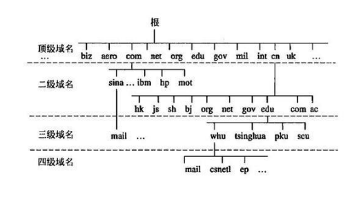
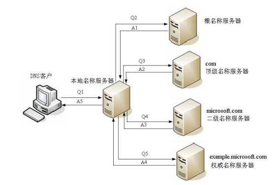
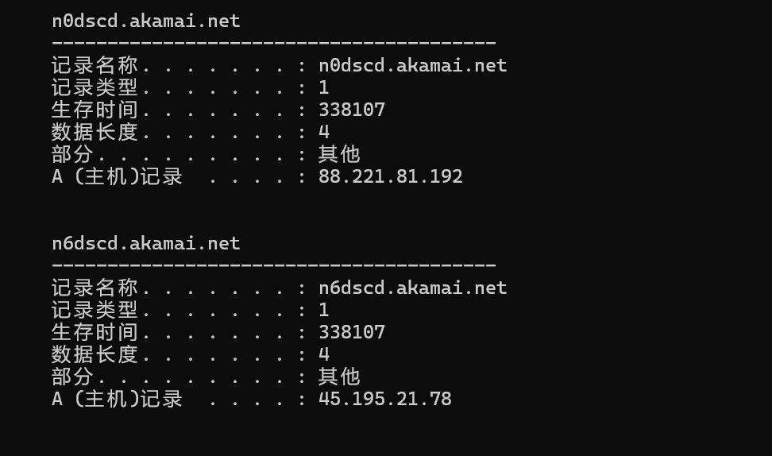

## 应用层

* [x] 应用层的常见协议

* [x] 域名
    * 顶级域名的分类
    * 二级域名
    * DNS域名系统
    * DNS服务器
    * DNS常用命令

* [x] P地址的分配
    * IP地址的分配方式
    * DHCP动态主机配置协议
    * DHCP分配IP的4个阶段
    * DHCP的细节

---

应用层的常见协议:

* 超文本传输: HTTP,HTTPS
* 文件传输: FTP
* 电子邮件: SMTP,POP3,IMAP
* 动态主机配置: DHCP
* 域名系统: DNS

### 1. 域名 (Domain Name)

* 起因:由于IP地址不方便记忆,并且不能表示组织名称和性质,人们设计出域名(比如baidu.com)

* 实际上:,为了能够访问具体的主机,最终还是得知道目标主机的IP地址

* 国内阿里云域名申请注册:[国内注册要备案](https://wanwang.aliyun.com/)

* 根据级别不同，域名可以分为:
    * 顶级域名（Top-level Domain，简称TLD）
    * 二级域名
    * 三级域名 
    * ...

#### 1.1 顶级域名的分类

1. 通用顶级域名（General Top-level Domain，简称gTLD） 
    *  .com（公司），.net（网络机构），.org（组织机构），.edu（教育） 
    * .gov（政府部门），.int（国际组织）等 

2. 国家及地区顶级域名（Country Code Top-level Domain，简称ccTLD） 
    * .cn（中国）、.jp（日本）、.uk（英国） 

3. 新通用顶级域名（New Generic Top-level Domain，简称：New gTLD） 
    * .vip、.xyz、.top、.club、.shop等

#### 1.2 二级域名

* 二级域名是指顶级域名之下的域名 

* 在通用顶级域名下，它一般指域名注册人的名称，例如google、baidu、microsoft等 

* 在国家及地区顶级域名下，它一般指注册类别的，例如com、edu、gov、net等

#### 1.3 DNS域名系统

* DNS的全称是: Domain Name System,译为: 域名系统

* 利用DNS协议,可以将域名(比如baidu.com)解析成对应的IP地址(比如220.181.38.148)

* DNS可以基于UDP协议,也可以基于TCP协议,服务器占用53端口

    

#### 1.4 DNS服务器

* 客户端首先会访问最近的一台DNS服务器（也就是客户端自己配置的DNS服务器,很多时候DNS服务器就是自己的网关） 
* 所有的DNS服务器都记录了DNS根域名服务器的IP地址 
* 上级DNS服务器记录了下一级DNS服务器的IP地址 
* 全球一共13台IPv4的DNS根域名服务器、25台IPv6的DNS根域名服务器
* 根服务器储存着顶级域服务器所对应的IP地址可以解释`.com.`

#### 1.5 DNS常用命令

* ipconfig /displaydns：查看DNS缓存记录 

* ipconfig /flushdns：清空DNS缓存记录 
* ping 域名 
* nslookup 域名

### 2. IP地址的分配

#### 2.1 IP地址的分配方式

#### 2.2 DHCP动态主机配置协议

#### 2.3 DHCP分配IP的4个阶段

#### 2.4 DHCP的细节
